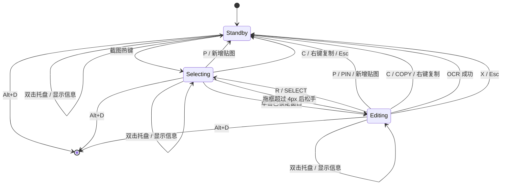

# rshot 设计文档

> 文档状态：当前实现基线
>
> 适用版本：v0.2.10
>
> 更新规则：交互状态、输出格式、平台边界或资源占用策略变化时同步更新本文档

## 记录目的

这份文档把 rshot 的功能说明整理成可实现、可检查的设计规则。它回答以下问题：

1. rshot 解决什么问题，当前范围到哪里；
2. 截图会话保存哪些数据，界面会处于哪些状态；
3. 鼠标、键盘和工具栏事件怎样推进状态；
4. 截图复制、OCR 和置顶贴图分别使用哪一份图像；
5. Windows 相关能力与核心交互怎样分工；
6. 内存、延迟、故障和兼容性之间怎样取舍；
7. 哪些案例必须通过，才能认为一次修改没有破坏现有规则。

本文档描述产品规则和模块契约。具体函数名可以调整，状态、不变量和可见行为需要保持一致，除非先修改设计决定。

## 1. 问题、目标与范围

### 1.1 问题

Windows 用户在写文档、沟通和排查问题时，经常需要完成一段连续操作：唤起截图、锁定窗口或框选区域、添加标注、复制图片、识别文字，或把截图留在屏幕上参考。操作入口分散会增加切换成本，也容易截到已经变化的画面。

### 1.2 目标

rshot 在一个冻结画面上完成选择、编辑、OCR、复制和置顶贴图。没有贴图时，程序待命只保留托盘、热键和配置；保留贴图时只常驻各贴图的最终像素与窗口资源。

### 1.3 成功条件

- 用户只能通过全局截图热键进入截图会话；
- 双击托盘图标显示作者、版本和当前热键设置，不触发截图；
- 截图内容在会话内保持冻结，重新选择不会重新抓屏；
- 左键在不同窗口上下文中只有一个主要含义：选择态框选、编辑态标注、独立贴图窗口移动；
- 图片复制同时支持位图粘贴和文件路径粘贴；
- OCR 只识别原始选区，用户画的标注不会进入识别输入；
- 关闭截图会话后释放原始截图、标注和遮罩窗口，不影响已经保留的贴图；
- 同一时间最多存在一个截图会话和八张相互独立的置顶贴图；
- 已有贴图不会进入新截图，截图会话结束后自动恢复显示。

### 1.4 当前范围

- Windows 单机应用；
- 捕获鼠标所在显示器；
- 自动锁定可见顶层窗口；
- 手动矩形框选；
- 画笔、直线、矩形、文字和颜色标注；
- 图片复制、Windows 本地 OCR、最多八张置顶贴图；
- 一次会话内重新选择；
- 全局截图热键、退出热键和托盘信息入口。

### 1.5 暂不包含

- macOS、Linux 和移动平台；
- 截图历史、云同步和账号系统；
- 滚动长截图、录屏、延时截图和全屏放大镜；
- 标注对象的选择、移动、缩放和分层编辑；
- 自带跨语言 OCR 模型；
- 在贴图窗口内继续标注或 OCR。

## 2. 外部输入、输出与约束

### 2.1 输入

| 输入来源 | 内容 | 处理规则 |
| --- | --- | --- |
| 全局热键 | 默认 `Alt+A` 截图、`Alt+D` 退出 | 仅在没有活动截图窗口时响应截图热键；已有贴图不阻止截图；退出热键结束事件循环 |
| 托盘 | 双击托盘图标 | 显示作者、版本及当前截图/退出热键；不得创建截图会话 |
| 鼠标 | 位置、左键、右键、拖动 | 含义由主状态和命中区域决定 |
| 键盘 | 工具快捷键、动作快捷键、文字输入 | 文字输入状态优先消费字符，避免把 `O`、`P` 等字符误当动作 |
| 输入法 | 预编辑文本、提交文本、启用和停用事件 | 只在文字草稿状态处理 |
| Windows 窗口系统 | 显示器、顶层窗口边界、DPI、剪贴板、OCR 语言包 | 通过 Windows 边界模块转换成内部数据 |
| 配置文件 | `hotkey`、`quit` | 启动时读取并注册；修改后重启生效 |

### 2.2 输出与状态变化

| 输出 | 内容 | 成功后的状态 |
| --- | --- | --- |
| 图片剪贴板 | `CF_DIB` 位图 | 回到待命 |
| 文件剪贴板 | `%TEMP%\rshot-clipboard\` 中的唯一 PNG，通过 `CF_HDROP` 提供 | 回到待命 |
| 文字剪贴板 | OCR 结果，使用 `CF_UNICODETEXT` | 回到待命 |
| 置顶窗口 | 已裁剪并合成标注的图像 | 新增一张独立贴图，截图会话回到待命 |
| 错误提示 | 启动错误或 OCR 错误 | 启动错误退出；OCR 错误保留当前编辑会话 |

### 2.3 平台与运行约束

- 启动时请求 Per-Monitor V2 DPI awareness，坐标统一为物理像素；当前实现忽略设置失败；
- 截图、窗口边界、选区和标注使用同一显示器坐标系；
- OCR 使用 `Windows.Media.Ocr`，可识别语言取决于系统已安装的 OCR 语言包；
- 窗口枚举依赖 DWM 与 Win32，文字渲染依赖 GDI；
- 文字字体固定为 GDI `Microsoft YaHei`，高度为 20 个物理像素，不自动换行；
- 验收目标为 Windows 10/11；当前构建未声明更早 Windows 版本的兼容承诺；
- 工具栏宽度为 570px，需要在 640px 宽窗口内保留左右至少 8px 的可见边距；
- 热键和托盘事件每 120ms 轮询一次；截图热键的触发延迟还包含截图时间；
- 文字光标约每 530ms 切换一次可见状态。

## 3. 数据、状态与关系

### 3.1 配置

```text
Config = {
  hotkey: String,
  quit: String
}
```

默认值为 `Alt+A` 和 `Alt+D`。配置只在启动时加载，运行中不热更新。

### 3.2 截图会话

```text
ScreenshotSession = {
  window,
  drawing_surface,
  session_image: RGBA image,
  monitor_origin: (x, y),
  visible_windows: [WindowRect],
  selection: Optional<(point_a, point_b)>,
  mode: Selecting | Editing,
  annotations: [Annotation]
}
```

- `session_image` 在选择态和编辑态保存未经标注的原始冻结图；
- `monitor_origin` 负责屏幕坐标与遮罩窗口坐标之间的转换；
- `visible_windows` 在遮罩出现前按 Z 序保存，自动锁定取第一个命中的窗口；
- `selection` 保存两个对角点，使用时再归一化和裁剪；
- `annotations` 使用遮罩窗口内的绝对坐标，输出时减去选区左上角偏移。

### 3.3 标注

```text
Annotation = {
  shape: Pen([Point])
       | Line(start, end)
       | Rect(point_a, point_b)
       | Text(anchor, content),
  color: RGBA
}
```

标注按数组顺序绘制。`UNDO` 删除数组末尾元素。当前设计没有对象选择和中间层撤销树。

文字输入期间，数组末尾的 `Text` 是草稿：

- 回车或点击工具栏会提交非空草稿；
- `Esc` 会丢弃当前草稿；
- 空草稿在提交时也会被丢弃；
- 输入法预编辑文本单独保存，只用于界面显示，不直接写入最终内容；
- 文字草稿创建时使用当前颜色；点击工具栏 `COLOR` 会先提交草稿，再为后续标注选择颜色。

### 3.4 置顶贴图

创建贴图前，选区和标注被扁平化为最终 RGBA 图像；整屏且没有标注时直接转移原图，不另建一份同尺寸输出。贴图不再保留独立标注对象，每张贴图按窗口 ID 独立保存：

```text
PinnedImage = {
  window,
  drawing_surface,
  flattened_image: RGBA image,
  window_position: ScreenPoint,
  pointer_position: Point,
  drag_state: Optional<(cursor_start, window_start)>,
  minimum_window_size: 56 × 44
}
```

App 使用 `Map<WindowId, PinnedImage>` 保存贴图，数量上限为 8。关闭、拖动和渲染事件只作用于命中的窗口 ID。

最小窗口尺寸为关闭按钮保留可点击区域。图像小于窗口时，空余区域只承担控制入口，不改变原图尺寸。
当前渲染器用黑色填充这部分空余区域，因此极小贴图可能出现黑色边带；它属于最小控制尺寸的结果，不属于原图内容。

### 3.5 OCR 输入

```text
OcrInput = crop(session_image, selection), where mode = Editing
```

OCR 不使用已经合成标注的输出图。选区超过系统 OCR 最大尺寸时等比缩小；整图且无需缩放时直接借用原始像素，避免先复制一份 RGBA 数据。

### 3.6 不变量

1. 待命状态没有活动截图窗口、活动绘图表面和会话截图像素，但可以存在独立贴图；
2. 活动会话必须同时拥有窗口、绘图表面和会话图像；
3. 编辑态必须有有效选区；
4. 每张贴图独占窗口、Surface、最终图像、指针位置和拖动状态；
5. 贴图数量不得超过 8，达到上限时不得破坏当前截图会话；
6. `text_editing = true` 时，主状态为编辑态，最后一条标注为文字草稿；
7. `drawing = true` 时，主状态为编辑态，最后一条标注是正在更新的非文字图形；
8. 自动锁定窗口和手动框选都只能引用当前冻结画面的坐标；
9. 重新选择保留原始图像，清除旧选区和全部标注；
10. 图片输出按“裁剪原图 → 按顺序合成标注”生成；
11. OCR 按“裁剪原图 → 必要时缩放 → 系统识别”生成；
12. 任意时刻最多存在一个活动截图窗口；贴图窗口独立计数；
13. 新截图开始前清除贴图拖动状态、隐藏全部贴图并刷新 DWM，结束或失败后无激活地恢复；
14. 关闭活动截图窗口后，下一次截图必须从新的屏幕捕获和空标注集合开始；
15. 屏幕坐标与当前显示器窗口坐标只通过 `monitor_origin` 换算；
16. 裁剪前必须归一化反向拖拽坐标并限制到图像边界，零宽或零高区域不产生输出；
17. `SetClipboardData` 成功后，全局内存所有权转交 Windows，应用不得再次释放；
18. 当前捕获、编码和 OCR 都在 UI 线程同步推进，没有后台任务并发修改会话。

## 4. 主状态机

`Mode` 只表示活动截图窗口内部的选择或编辑状态。待命状态由活动截图 `window = None` 表示；贴图集合与这条状态机正交存在。



任意主状态下可以同时存在 0～8 张贴图。贴图的拖动、关闭和重绘按自身 `WindowId` 路由，不改变活动截图状态；开始截图时全部贴图暂时隐藏，截图会话结束后恢复。

### 4.1 状态定义

| 状态 | 用户看到的内容 | 左键主要含义 | 允许的结束动作 |
| --- | --- | --- | --- |
| 待命 `Standby` | 托盘图标 | 无 | `Alt+D` 退出 |
| 选择 `Selecting` | 冻结画面、遮罩和红色选框 | 单击锁定窗口；拖动建立手动选区 | 复制、置顶、取消、退出 |
| 编辑 `Editing` | 选区、标注和工具栏 | 在工具栏操作，或在选区内创建标注 | 复制、OCR、置顶、重新选择、取消、退出 |
| 独立贴图（不属于 `Mode`） | 无边框置顶图和右上角关闭按钮 | 拖动当前贴图；命中关闭按钮时只关闭当前贴图 | 右键、`Esc`、关闭按钮、退出 |

### 4.2 选择态子状态

| 条件 | 行为 |
| --- | --- |
| 鼠标未按下，尚未手动框选 | 自动锁定光标下最上层的有效窗口 |
| 左键按下，移动未超过 4px | 保留当前自动锁定框，等待判断单击或拖动 |
| 任一方向移动超过 4px | 建立手动选区，停止自动锁定 |
| 单击松手且已有自动锁定框 | 固定该窗口并进入编辑态 |
| 单击松手且没有任何选区 | 保持选择态 |
| 拖框松手 | 固定手动选区并进入编辑态 |

有效窗口满足以下条件：可见、未最小化、未被 DWM cloaked、宽高至少 40px。窗口边界优先使用 DWM 扩展边框，获取失败时使用 `GetWindowRect`，最终四边向内缩 1px。

### 4.3 编辑态事件优先级

左键命中顺序固定为：

1. 色板色块；
2. 工具栏按钮；
3. 选区画布。

色板打开时点击画布只关闭色板，本次点击不创建标注。按下和松开命中同一按钮或色块时才执行动作，避免拖出控件后误触。

### 4.4 `Esc` 优先级

1. 正在输入文字：取消当前文字草稿；
2. 色板打开：只关闭色板；
3. 其他截图情况：关闭当前截图会话，回到待命；贴图窗口收到 `Esc` 时只关闭自身。

## 5. 关键操作规则与契约

### 5.1 开始截图

**输入**：截图触发事件、当前鼠标屏幕坐标。

**前置条件**：没有活动截图窗口；独立贴图可以存在。

**步骤**：

1. 读取鼠标位置；
2. 无激活地隐藏全部贴图并刷新 DWM；
3. 找到鼠标所在显示器并捕获整屏 RGBA 图像；
4. 重置选区、标注、工具、颜色和输入状态；
5. 保存显示器原点；
6. 在遮罩出现前记录可锁定窗口；
7. 创建全屏无边框遮罩并请求首帧绘制。

**成功结果**：进入选择态，默认工具为红色画笔。

**失败结果**：鼠标、显示器或截图获取失败时不创建会话，恢复全部贴图并保持待命。

### 5.2 重新选择

**输入**：`R` 或 `SELECT`。

**前置条件**：当前处于编辑态。

**结果**：

- 保留原始冻结图和窗口快照；
- 清除选区、标注、文字草稿、色板和绘制状态；
- 保留当前工具和颜色；
- 回到选择态并恢复窗口自动锁定。

重新选择不得再次截屏，否则前后两次选区可能来自不同画面。

### 5.3 创建标注

| 工具 | 按下 | 拖动或输入 | 松开或提交 |
| --- | --- | --- | --- |
| `PEN` | 建立包含起点的点列 | 追加经过点 | 单点补成可见圆点 |
| `LINE` | 起点和终点都设为按下点 | 更新终点 | 起终点相同则丢弃 |
| `RECT` | 两个对角点都设为按下点 | 更新第二个点 | 两点相同则丢弃 |
| `TEXT` | 在点击位置建立空草稿 | 接收键盘和 IME 文本 | 回车提交，`Esc` 取消，空内容丢弃 |

画布外的左键不创建标注。标注从选区内开始后可以拖到选区外，最终图片由裁剪边界截断。所有标注坐标都保留在遮罩窗口坐标系中。

### 5.4 图片复制

**入口**：`COPY`、`C` 或选择/编辑态右键松开。

**输入图像**：

- 没有选区和标注时直接使用整张原图；
- 其他情况裁剪选区，再按顺序合成标注。

**输出格式**：

1. `CF_DIB`：供聊天软件、Word、画图等直接粘贴位图；
2. `CF_HDROP`：指向 `%TEMP%\rshot-clipboard\` 中本次复制专用的 PNG，供终端和资源管理器按文件处理。

编码前先隐藏遮罩，避免用户看到卡顿。写入时以当前遮罩窗口作为剪贴板 owner，并分别返回 `CF_DIB` 与 `CF_HDROP` 的发布结果。至少一种格式发布成功且剪贴板正常关闭后才结束会话；两种格式都失败或剪贴板关闭失败时显示具体错误、恢复遮罩并保留原图、选区和标注，用户可以再次点击 `COPY` 或按 `C` 重试。
右键确认或复制会先提交已经写入草稿的文字；尚处于输入法预编辑阶段、还没有 Commit 的内容不会进入图片。

临时 PNG 使用时间、进程号和进程内序号命名，并通过 `create_new` 原子创建。只有 `CF_HDROP` 成功写入剪贴板后才保留文件；创建、编码或发布失败时立即删除本次文件，不影响 DIB 位图输出。

### 5.5 OCR

**入口**：`OCR` 或编辑态按 `O`。

**前置条件**：当前处于编辑态并有选区。

**步骤**：

1. 提交正在输入的非空文字草稿；
2. 隐藏遮罩；
3. 从原始图像裁出选区，不合成标注；
4. 超过 `OcrEngine::MaxImageDimension` 时等比缩小；
5. 使用系统用户语言创建 OCR 引擎；
6. 识别并去掉结果首尾空白；
7. 按 UTF-16LE 和结尾空字符写入 `CF_UNICODETEXT`。

**结果**：

| 情况 | 对用户的结果 | 会话状态 |
| --- | --- | --- |
| 识别到非空文字且剪贴板写入成功 | 可直接粘贴文字 | 关闭并回到待命 |
| 没有识别到文字 | 提示缩小选区或提高文字清晰度 | 恢复编辑界面 |
| OCR 引擎、缓冲区或识别失败 | 显示具体错误 | 恢复编辑界面 |
| 文字已识别但剪贴板写入失败 | 提示重试 | 恢复编辑界面 |

OCR 在主事件线程同步等待，当前没有超时或取消机制。遮罩会先隐藏，但这段时间 rshot 不能处理其他窗口事件。识别时间明显增长时应改为工作线程和结果事件。

### 5.6 置顶贴图

**入口**：`PIN` 或选择/编辑态按 `P`。

**输入图像**：与图片复制相同，使用裁剪并合成标注后的图像；无裁剪、无标注时直接转移原图所有权。

**结果**：

- 全屏遮罩改成按最终图尺寸显示的无边框窗口；
- 窗口级别设为始终置顶；
- 窗口移动到选区在屏幕上的左上角；
- 活动窗口、Surface 和最终图像转移到贴图集合，截图会话回到待命；
- 每张贴图拥有独立的拖动状态，右键、`Esc` 或右上角 `X` 只关闭当前贴图；
- 达到 8 张上限时提示用户，当前截图和编辑内容保持不变。

贴图存在时仍可使用截图热键。开始截图前全部贴图暂时隐藏并刷新 DWM，避免进入截图或盖住遮罩；复制、取消、失败或生成新贴图后无激活地恢复。双击托盘仍只显示信息窗口。

### 5.7 快捷键规则

| 状态 | 快捷键 | 动作 |
| --- | --- | --- |
| 选择、编辑 | `P` | 置顶当前选区或整图 |
| 编辑 | `B` / `N` / `M` / `T` | 画笔 / 直线 / 矩形 / 文字 |
| 编辑 | `Ctrl+Z` | 删除最后一条标注 |
| 编辑 | `R` | 重新选择 |
| 编辑 | `O` | OCR |
| 选择、编辑 | `C` | 复制图片 |
| 文字输入 | `Enter` | 提交文字草稿，不复制截图 |
| 选择、编辑 | `Esc` | 按第 4.4 节的优先级取消或关闭截图会话 |
| 当前贴图 | `Esc` | 只关闭获得该按键事件的贴图 |

文字输入和输入法预编辑优先于工具快捷键。用户输入字母 `p`、`o`、`c` 时必须写入文字草稿，不能触发置顶、OCR 或复制。除 `Ctrl+Z` 外，当前实现不区分动作键的修饰键，因此 `Ctrl+C` 也会复制截图；新增快捷键时需要显式决定是否接受修饰键。

## 6. 抽象与模块边界

当前实现已经按依赖方向拆分。根入口只启动应用，窗口生命周期和事件编排留在 `app`，纯状态、算法和平台调用分别落在叶子模块：

| 文件 | 职责 |
| --- | --- |
| `src/main.rs` | Windows 子系统声明和应用入口 |
| `src/app/mod.rs` | 配置、截图会话、窗口与 Surface 生命周期、跨模块编排 |
| `src/app/handler.rs` | winit、热键、托盘、鼠标、键盘和 IME 事件路由 |
| `src/app/pinned.rs` | 独立贴图窗口、拖动状态、绘图表面、重绘和最多八张限制 |
| `src/app/state.rs` | 主模式枚举和可恢复会话错误；选区与窗口生命周期仍由应用会话持有 |
| `src/app/geometry.rs` | 矩形归一化、命中判断、裁剪和平台无关窗口矩形 |
| `src/app/editor.rs` | 编辑状态、标注数据、工具栏与色板布局和命中测试 |
| `src/app/render.rs` | 像素绘制、标注合成和最终图片生成 |
| `src/app/clipboard.rs` | 图片/文字剪贴板、DIB/HDROP、唯一临时 PNG 与 12 小时清理 |
| `src/app/ocr.rs` | 原图选区准备、缩放和 Windows OCR 调用 |
| `src/app/windows_adapter.rs` | DPI、窗口枚举、光标、无激活窗口显隐、GDI 文字、消息框、WinRT 生命周期和托盘图标 |

| 逻辑模块 | 拥有的知识 | 输入 | 输出或失败 |
| --- | --- | --- | --- |
| 运行时与配置 | 事件循环、热键、托盘、配置路径、进程退出 | 配置和系统事件 | 截图触发、信息显示、退出事件、启动错误 |
| Windows 平台边界 | DPI、窗口枚举、DWM、GDI、消息框和 WinRT 生命周期 | 平台调用参数 | 内部坐标、像素、文本或平台错误 |
| 截图捕获 | 鼠标所在显示器、RGBA 原图 | 鼠标屏幕坐标 | 原图、显示器原点或捕获失败 |
| 会话状态机 | 主状态、选区、草稿、优先级和状态转移 | 归一化输入事件 | 新状态和需要执行的动作 |
| 编辑器 | 工具、标注、文字草稿、颜色 | 选区内指针和文字事件 | 标注集合 |
| 布局与命中测试 | 工具栏、色板、关闭按钮的位置 | 窗口尺寸、选区、指针位置 | 命中的控件 |
| 渲染与合成 | 遮罩、选框、标注、文字、控件和像素格式 | 原图与会话状态 | 窗口缓冲或最终 RGBA 图像 |
| 图片输出 | 裁剪、DIB、临时 PNG、`CF_HDROP` | 原图、选区、标注 | 图片剪贴板 |
| OCR | OCR 输入裁剪、尺寸适配、系统识别、Unicode 剪贴板 | 原图和选区 | 文字或可展示错误 |
| 贴图窗口 | 合成图、窗口位置、拖动和关闭 | 最终图像与选区位置 | 置顶窗口状态 |

### 6.1 接口约束

- 核心状态机不直接理解 Win32 句柄；平台边界把系统事件转换成内部事件；
- 编辑器只修改标注数据，不负责剪贴板和窗口生命周期；
- OCR 接口接收原图和选区，调用方不能传入已合成标注的图片；
- 图片输出接口接收原图、选区和标注，输出模块负责合成顺序；
- 布局函数和命中测试必须使用同一组尺寸常量；
- 平台错误在边界处转换成可记录的错误码和可展示文本；
- 新增工具时同时扩展数据定义、输入处理、窗口渲染、输出合成和回归测试。

### 6.2 变化影响

| 变化 | 主要受影响模块 | 必须补充的验证 |
| --- | --- | --- |
| 新增标注工具 | 编辑器、工具栏、渲染、图片输出 | 草稿、定型、撤销、选区偏移、最终像素 |
| 调整工具栏布局 | 布局与命中测试、窗口渲染 | 每个按钮命中、背景边界、640px 窄窗口 |
| 新增图片输出格式 | 图片输出、剪贴板边界 | 格式头、所有权转移、失败恢复 |
| 更换 OCR 后端 | OCR、错误提示、依赖配置 | 语言、隐私、尺寸、延迟、Unicode 文本 |
| 支持多贴图 | 会话所有权、窗口集合、热键规则、内存策略 | 多窗口拖动、独立关闭、截图重入、资源释放 |
| 支持其他平台 | 平台边界、构建发布 | 坐标、热键、托盘、剪贴板、字体和 OCR |

## 7. 约束与取舍

### 7.1 单截图会话与多贴图

当前只允许一个选择或编辑中的截图会话，同时允许最多八张独立贴图。活动会话继续使用单一窗口所有权；贴图按 `WindowId` 保存在独立集合中，从而允许对照多张图片并继续截图。

八张上限防止全屏或 4K 贴图无界累积内存。达到上限时不自动淘汰旧贴图，也不丢弃当前编辑内容，由用户明确关闭一张后重试。

### 7.2 冻结一次，重复选择

`SELECT` 保留原图并重新框选，保证前后选择来自同一时刻。代价是用户无法通过重新选择获得最新桌面内容；需要新画面时应关闭会话并重新截图。

### 7.3 软件渲染

softbuffer 和 CPU 像素合成让依赖和渲染规则保持简单，也方便逐像素测试。高分辨率画面频繁重绘时会增加 CPU 和内存带宽占用。

重新评估信号：4K/8K 标注出现持续卡顿，或需要缩放、旋转、透明图层和动画。

### 7.4 内存

- 待命时不保留截图像素；
- 原始截图约占 `4 × W × H` 字节，softbuffer 显示缓冲约再占 `4 × W × H` 字节；
- 3840×2160 时，RGBA 原图约占 31.6MiB，两块基础像素缓冲合计约 63.3MiB；
- `App` 不长期保存第二份显示图对象，但活动窗口的 Surface 仍持有独立显示缓冲；
- 无裁剪、无标注的置顶操作直接转移原图；
- 图片复制会临时产生裁剪或合成后的 RGBA、24 位 DIB、PNG 编码缓冲和剪贴板全局内存；
- 裁剪、标注合成和 OCR 会产生短时额外像素缓冲，峰值高于两块基础缓冲；
- OCR 的 DataWriter 和 SoftwareBitmap 会让选区像素在识别期间存在多份，短时峰值不能当成常驻占用；
- 每张贴图存在期间会长期保留自己的最终 RGBA 图和 Surface，最多八组；
- 画笔按指针移动事件追加点，目前没有抽稀或点数上限；
- 每次重绘都由 CPU 转换像素并逐像素处理选区外变暗效果；
- 关闭截图会话必须清空会话图像、遮罩窗口、标注和窗口快照，但不得清空独立贴图；关闭单张贴图只释放该贴图资源。

重新评估信号：8K 截图、近全屏 OCR 或虚拟机环境出现明显换页；此时需要测量峰值，并考虑直接写 SoftwareBitmap 缓冲或限制 OCR 输入分辨率。待命状态每 120ms 唤醒一次，常驻功耗也需要纳入测量。

### 7.5 系统 OCR

使用 Windows OCR 可以避免随程序分发模型和联网请求，二进制仍保持较小。识别语言和准确率受系统语言包、字体、清晰度和 Windows 版本影响。

重新评估信号：需要稳定的多语言混合识别、离线模型版本固定、表格结构识别或跨平台支持。

### 7.6 双剪贴板格式

图片同时提供 DIB 和唯一临时 PNG 文件，覆盖“粘贴图片”和“粘贴文件”两类消费者。后一次复制创建新文件，不覆盖前一次剪贴板路径。

程序启动后立即检查一次临时文件，之后每 12 小时在后台检查一次。只删除 rshot 专用目录中名称严格匹配且修改时间超过 12 小时的普通 PNG；不递归目录，也不跟随符号链接或 Windows reparse point。当前系统剪贴板仍引用的文件始终保留，无法读取剪贴板时本轮停止清理。旧版 `%TEMP%\rshot.png` 只按精确路径执行同样规则。

12 小时是最短保留时间。由于扫描间隔也是 12 小时，普通文件通常会保留 12～24 小时；程序未运行或系统时间回拨时可能更久。

重新评估信号：用户需要截图历史、永久文件路径，或剪贴板管理器需要在 12 小时后读取历史路径。

## 8. 故障、恢复与观察

### 8.1 故障处理表

| 故障 | 当前表现 | 应保留的事实 | 恢复规则 | 状态 |
| --- | --- | --- | --- | --- |
| 配置读取、热键注册或 WinRT 初始化失败 | 启动错误弹窗，进程退出 | 不创建托盘和截图会话 | 修正配置或系统环境后重启 | 已实现 |
| DPI awareness 设置失败 | 静默继续运行 | 后续坐标可能出现缩放偏差 | 把设置结果纳入启动错误或诊断信息 | 设计缺口 |
| 鼠标位置、显示器或截图获取失败 | 截图入口无反应 | 保持待命，不留下半个窗口 | 增加可理解提示或本地错误日志 | 设计缺口 |
| 遮罩窗口、图形上下文或绘图表面创建失败 | 显示错误并关闭本次截图 | 已捕获图像不得长期滞留；热键和托盘继续工作 | 先释放局部资源，再清理会话并回到待命 | 已实现 |
| 截图 Surface resize、buffer 获取或 present 失败 | 显示一次错误并关闭本次截图 | 常驻进程、热键、托盘和既有贴图继续工作 | 渲染函数返回会话错误；先释放 Buffer，再按 Surface、Window 顺序清理并恢复贴图 | 已实现 |
| 单张贴图 resize、buffer 获取或 present 失败 | 显示一次错误并只关闭故障贴图 | 其他贴图和活动截图不得受影响 | 按 `WindowId` 移除故障贴图，释放其 Surface 和 Window | 已实现 |
| 图片剪贴板被占用、两种格式均失败或剪贴板关闭失败 | 错误弹窗并恢复编辑界面 | 原图、选区和标注保留到用户能重试；已转移给系统的内存不得重复释放 | 返回每种格式的发布结果；至少一种成功且正常关闭剪贴板才结束会话 | 已实现 |
| 临时 PNG 创建或编码失败 | 省略文件格式，仍尝试提供 DIB | 图片位图输出不受文件格式失败影响 | 删除半成品并降级为 DIB | 已实现 |
| `CF_HDROP` 发布失败 | 省略文件格式，仍保留已成功写入的 DIB | 未发布的文件不得成为孤儿 | 立即删除本次唯一 PNG | 已实现 |
| OCR 没有识别到文字 | 信息提示 | 原图、选区和标注不变 | 恢复编辑界面，允许重选或重试 | 已实现 |
| OCR 语言包、缓冲区或引擎失败 | 错误弹窗 | 原图、选区和标注不变 | 恢复编辑界面 | 已实现 |
| OCR 文字剪贴板写入失败 | 错误弹窗 | 识别前会话不丢失 | 恢复编辑界面 | 已实现 |
| 渲染表面尺寸与截图不一致 | 右侧或下方补黑 | 行不能错位，不能读取越界 | 按每行最小宽度复制 | 已实现 |
| 进程被强制结束 | 活动会话消失 | 配置文件和系统剪贴板保持独立 | 重新启动；不恢复未完成标注 | 当前范围 |

### 8.2 质量场景

| 场景 | 刺激 | 期望响应 | 判断标准 |
| --- | --- | --- | --- |
| 无贴图长期常驻 | 用户数小时不截图 | 不保留截图像素，不创建隐藏遮罩 | `img/window/surface` 为空，托盘和热键仍可用 |
| 高 DPI 多显示器 | 鼠标位于非主屏并触发截图 | 捕获鼠标所在屏，选框与像素对齐 | 窗口边界、手动框和输出图无缩放偏移 |
| 窄显示区域 | 遮罩宽度为 640px | 工具栏和关闭按钮完整可见 | 工具栏宽度不超过 624px |
| 近全屏 OCR | 选区接近 4K 或更大 | 必要时缩放，识别结束后释放临时缓冲 | 无越界、无长期内存增长，结果可粘贴 |
| 输入法组合 | 用户输入中文并选择候选词 | 预编辑文本只显示一次，提交文本不重复 | 最终文字与输入法提交内容一致 |
| 剪贴板竞争 | 其他程序短暂占用剪贴板 | 用户得到失败提示并能重试 | 无可用格式或剪贴板未正常关闭时会话不丢失；调用方能读取实际成功的格式 |
| 会话渲染失败 | 创建窗口、resize、buffer 或 present 返回错误 | 只关闭本次截图，提示一次后允许重新截图 | 会话资源为空，热键编号和既有贴图不变；旧窗口事件不影响新会话 |
| 临时文件清理 | 启动或距上次检查满 12 小时 | 后台删除过期文件，不阻塞截图交互 | 新文件、外来文件、目录、未来时间文件和当前剪贴板路径均保留 |
| 贴图拖动 | 在贴图任意非关闭区域按住左键移动 | 窗口跟随系统光标移动 | 不重新框选，不修改贴图像素 |
| 多贴图连续截图 | 已有多张贴图时再次按截图热键 | 贴图暂时隐藏且不进入冻结画面，会话结束后恢复 | 同时最多一个截图会话、最多八张贴图，恢复时不抢焦点 |

### 8.3 可观测性与隐私

当前 Release 构建没有控制台，启动失败通过弹窗展示；Debug 构建打印配置路径。项目尚无持久日志。

后续增加日志时遵守以下规则：

- 记录事件名、错误码、耗时、显示器尺寸、选区尺寸和结果计数；
- 不记录截图像素、OCR 文字、剪贴板内容和窗口标题；
- 每次截图会话分配临时会话编号，关闭后不用于跟踪用户；
- 捕获、剪贴板、OCR 和窗口创建失败使用稳定错误码；
- 日志文件有大小上限和轮换规则，默认允许用户关闭。

## 9. 验收案例

### 9.1 自动测试

| 类别 | 必须覆盖的规则 |
| --- | --- |
| 裁剪 | 反向拖动、越界坐标、零尺寸保护 |
| 图片格式 | DIB 头、BGR 顺序、行对齐 |
| 图片发布策略 | 无格式、仅 DIB、仅文件和两种格式成功四种结果；至少一种成功且 `CloseClipboard` 成功才结束会话 |
| 标注 | 画笔点、直线和矩形颜色、选区偏移、文字绘制不崩溃 |
| 草稿 | 退化线条丢弃、单点画笔可见、空文字丢弃、取消文字清理状态 |
| 输入法 | 提交和取消清空预编辑文本，文字草稿使用创建时的当前颜色 |
| 工具栏 | 每个按钮命中、正反向映射、背景结束位置、640px 宽度 |
| 色板 | 每个色块命中、颜色不重复、工具栏与弹层命中不混淆 |
| 重新选择 | 保留原始图，清除选区、标注和输入状态 |
| OCR 输入 | 只读取原始选区、反向和越界选区、尺寸上限缩放、整图复用原始缓冲 |
| 文字剪贴板 | 中文、Emoji、换行和结尾空字符 |
| 会话失败恢复 | 清空图像和编辑状态、保留全局热键、同一故障只通知一次、新会话可再次恢复 |
| 临时 PNG | 同一时刻分配唯一文件、PNG 编码有效、过期筛选、受保护路径、外来文件和 12 小时调度 |

### 9.2 手工端到端测试

1. 待命时按 `Alt+A`，确认捕获鼠标所在显示器；
2. 移动鼠标经过重叠窗口，确认红框锁定最上层可见窗口；
3. 单击锁定窗口，确认进入编辑态，没有直接复制；
4. 从任意方向拖框，确认松手后选区正确；
5. 分别用画笔、直线、矩形和中文文字标注，复制后检查坐标与颜色；
6. 文字输入时键入 `pocr`，确认只产生文字，不触发动作快捷键；
7. 点击 `SELECT`，确认画面内容不变化，旧标注消失；
8. 在画过标注的选区点击 `OCR`，确认识别内容来自原图；
9. 粘贴 OCR 中英文、换行和 Emoji，确认 Unicode 文本完整；
10. 模拟无 OCR 语言包或无文字选区，确认错误后仍可继续编辑；
11. 连续建立八张贴图，确认每张都能独立拖动，并可分别用 `X`、右键和 `Esc` 关闭；
12. 贴图存在时再次按截图热键，确认旧贴图不进入冻结画面；取消、复制或新增贴图后旧贴图全部恢复；
13. 已有八张贴图时尝试置顶第九张，确认提示上限且当前编辑内容不丢失；
14. 在 100%、125%、150% 缩放的多显示器组合下检查选框和输出；
15. 在 4K 显示器上连续执行截图、OCR、贴图和关闭，观察内存是否回落；
16. 分别向聊天软件、Word、画图、终端和资源管理器粘贴，检查位图与文件格式。
17. 用辅助程序临时独占剪贴板后执行复制，确认错误提示后原图、选区和标注仍在；释放剪贴板后重试成功。

### 9.3 完成定义

一次涉及交互或输出的修改满足以下条件后才可发布：

- 状态转移和失败路径已经写清；
- 自动测试通过；
- 受影响的端到端案例通过；
- Release 构建成功；
- 待命、活动截图和关闭后的内存行为没有明显回归；
- README 的操作说明与本文档一致；
- 新依赖的联网、权限、平台和二进制体积影响已经说明。

## 10. 设计决定

| 编号 | 决定 | 原因 | 代价 |
| --- | --- | --- | --- |
| D-01 | 一次截图只捕获鼠标所在显示器 | 操作目标明确，减少多屏大图内存 | 不能一次跨屏框选 |
| D-02 | 重新选择复用同一冻结画面 | 保证前后选区内容一致 | 不能在原会话获取最新桌面 |
| D-03 | 左键含义由主状态决定 | 选择、标注和移动互不冲突 | 新状态必须明确左键规则 |
| D-04 | `C` 复制截图，`Enter` 只提交文字 | 避免文字输入和截图确认共享按键 | 老的 Enter 复制习惯不兼容 |
| D-05 | OCR 使用原图选区 | 标注不会降低识别率或进入结果 | 无法直接识别用户后加的文字标注 |
| D-06 | 使用 Windows 系统 OCR | 无需联网和额外模型 | 语言与准确率依赖系统环境 |
| D-07 | 图片同时写 DIB 和唯一文件格式 | 覆盖图片消费者和文件消费者，连续复制互不覆盖 | PNG 至少占用磁盘 12 小时，需要周期清理 |
| D-08 | 一个活动截图会话可与最多八张独立贴图并存 | 支持多图对照和连续截图，同时限制常驻像素内存 | 多窗口事件必须按 `WindowId` 路由，截图期间需要隐藏并恢复贴图 |
| D-09 | 使用软件渲染和逐像素合成 | 行为直接、依赖少、容易测试 | 高分辨率复杂交互的性能上限较低 |
| D-10 | 窗口和渲染错误只终止对应截图会话或单张贴图 | 一次图形后端错误不能带走常驻热键、托盘和无关贴图 | 故障对象的当前内容会丢失，用户可能需要重新截图 |
| D-11 | 按状态、编辑、渲染、剪贴板、OCR 和 Windows 适配拆分应用 | 限制平台依赖扩散，让纯逻辑可独立测试 | 模块之间需要维护少量 `pub(super)` 接口 |
| D-12 | 图片输出以当前遮罩窗口持有剪贴板，至少一种格式发布成功且正常关闭剪贴板才结束会话 | 避免 `OpenClipboard(NULL)` 的无 owner 写入失败，也避免一次剪贴板竞争丢失编辑内容 | 部分成功时会降级为调用方实际收到的单一格式 |

## 11. 已知设计缺口与后续顺序

### P1：补充捕获失败反馈

截图入口失败时显示简短提示，并记录不含隐私内容的错误码。连续失败不能创建残留窗口或保留旧截图。

### P2：测量 OCR 峰值与延迟

记录 1080p、4K、近全屏选区和超大图缩放四组数据。OCR 超过可接受交互时间时移到工作线程，主线程通过事件接收结果。工作线程期间禁止重复提交 OCR，但允许用户取消会话。
