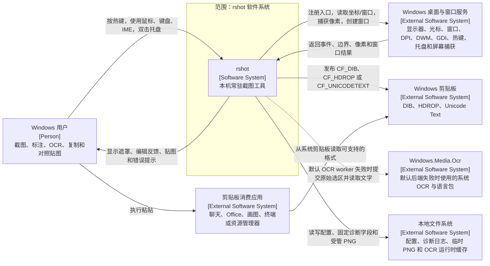
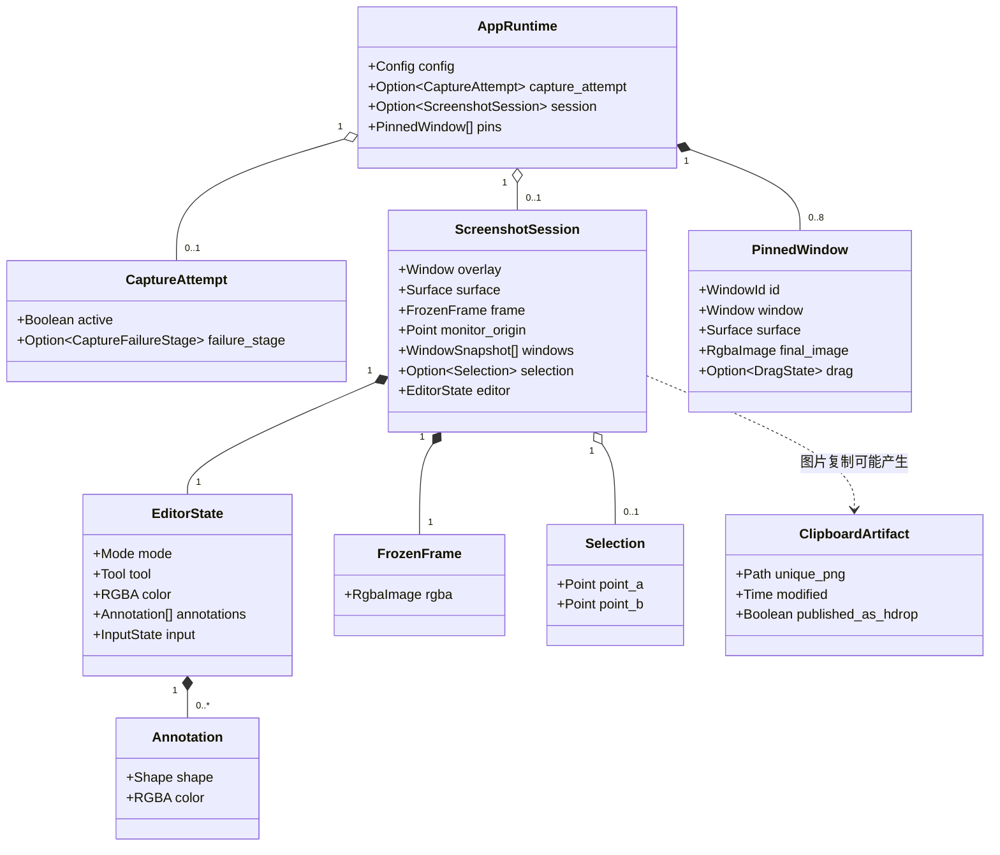
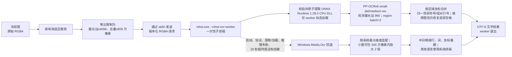
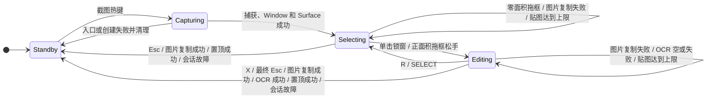
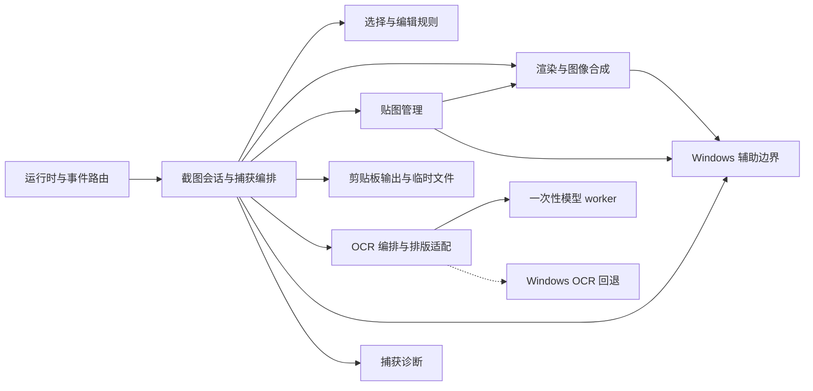
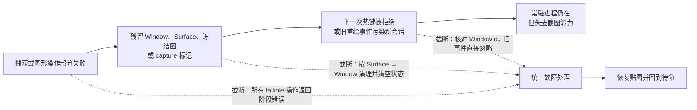
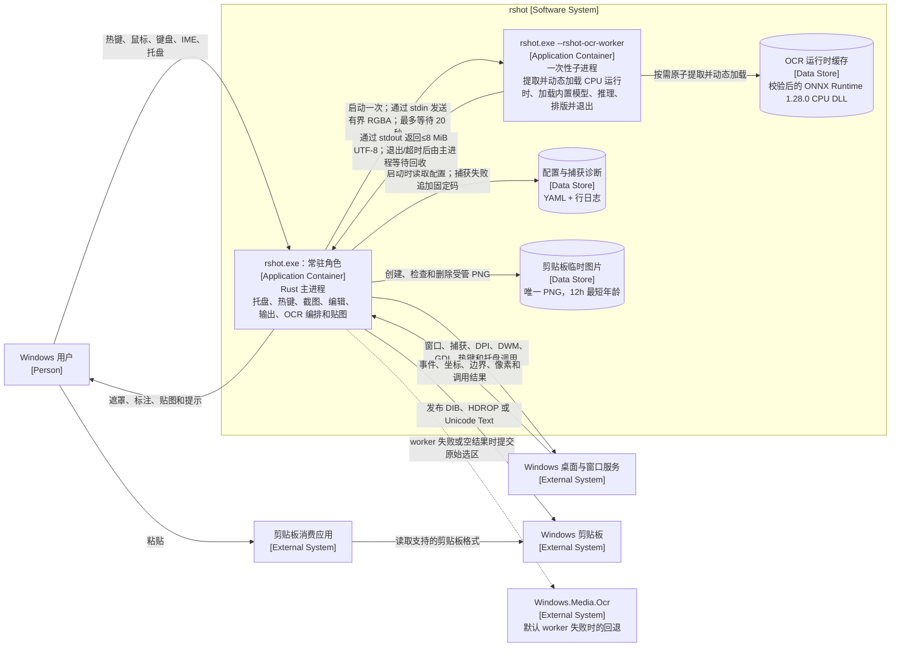
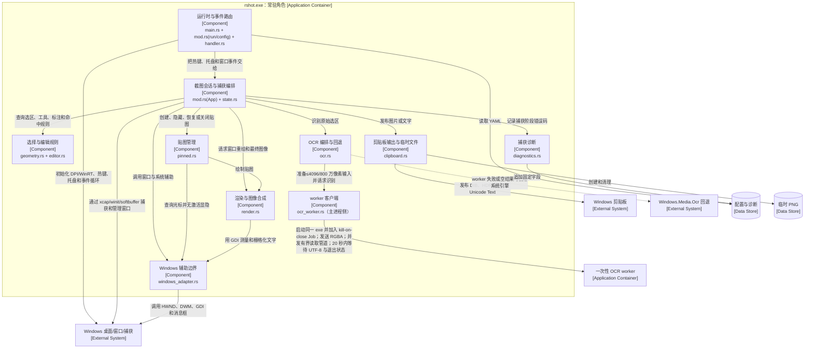
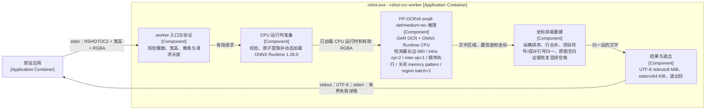
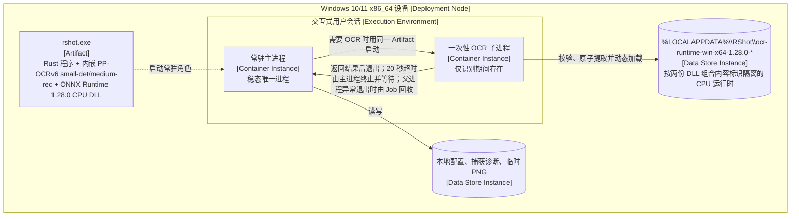

# rshot 设计文档

> 文档状态：当前实现基线
>
> 产品版本：v0.2.15
>
> 代码基线：`v0.2.15` 标签对应的 `7bc05f6`；高精度 OCR 实现提交为 `d1671d6`
>
> 更新规则：问题边界、交互状态、数据所有权、输出格式、平台依赖、故障恢复或资源策略变化时，同步更新本文档

## 记录目的

这份文档把 rshot 当前行为整理成能讨论、能实现、能检查的设计规则。它按以下顺序展开：

1. 重新表述问题，确定系统边界和外部关系；
2. 定义数据、状态、所有权和记录之间的关系；
3. 写清关键操作的契约、状态变化和失败结果；
4. 划分稳定职责、接口和变化边界；
5. 先确定质量要求、故障边界和恢复目标；
6. 比较候选方案，再记录架构决定；
7. 用 C4 Context、Container 和 Component 视图说明已经选定的架构。

第 2、3 节借用 HTDP 的检查方式：先定义数据形状，再用正常、边界和失败例子检查规则是否完整。本文描述当前实现，不把尚未落地的目标结构画成现状。具体函数名可以调整；外部行为、状态、不变量和接口契约改变时，需要先修改设计决定。

## 当前发布基线

- GitHub 已发布 [v0.2.15](https://github.com/idkwhatimdoing62/rshot/releases/tag/v0.2.15)，并设为 Latest；
- `cargo test --locked` 共 60 项，全部通过；
- Windows x64 便携 Release 已通过静态 CRT、系统 DLL 白名单、ONNX Runtime 版本/API 和真实模型推理检查；
- 829×313 与 894×235 两张真实混排样例均逐字匹配，OCR worker 在一次识别后退出并释放模型与推理内存；
- 发布包提供独立 `rshot.exe`、包含当前第三方许可证与声明材料的 ZIP 和 SHA-256 校验文件；rshot 项目自身许可证尚待所有者确定。

## 术语

| 术语 | 含义 |
| --- | --- |
| 捕获尝试 | 从接受截图热键开始，到成功提交截图窗口和 Surface，或失败清理完成为止的瞬时过程 |
| 截图会话 | 一次冻结画面的选择和编辑过程；概念上聚合原图、遮罩窗口、选区和编辑状态，当前代码没有同名独立结构体 |
| 冻结图 | 截图入口成功后保留的原始 RGBA 屏幕图像；重新选择、OCR 和最终输出都以它为源 |
| 选区 | 冻结图坐标系中的两个对角点；使用前必须归一化、裁剪并检查面积 |
| 标注 | 画笔、直线、矩形或文字及其颜色；按创建顺序叠加 |
| 输出图 | 从冻结图裁剪后按顺序合成标注得到的 RGBA 图像 |
| 置顶贴图 | 独立的无边框置顶窗口，持有已经扁平化的最终图像和自己的窗口资源 |
| 剪贴板制品 | 为 `CF_HDROP` 创建的唯一临时 PNG；发布成功后可以比截图会话活得更久 |
| 待命 | 没有活动截图窗口的常驻状态；托盘、热键和已有贴图仍可存在 |
| C4 Container | 可独立运行的应用/进程角色或数据存储。rshot 稳态只有常驻应用容器；执行 OCR 时会短暂增加一次性 worker 容器。Rust 文件、代码模块、线程、遮罩窗口和贴图窗口都不是 C4 Container |

---

## 1. 重新表述问题与系统边界

### 1.1 使用者与问题

rshot 服务于需要频繁引用屏幕内容的 Windows 用户。用户在写文档、沟通和排查问题时，通常要连续完成几件事：唤起截图、锁定窗口或框选区域、突出重点、复制图片、识别文字，或把截图留在屏幕上对照。

这些能力分散在多个工具中时，用户需要反复切换窗口；重新截图还可能得到不同时间的画面。rshot 用一次冻结画面承载选择、编辑、OCR、复制和置顶操作，使一次任务在同一上下文内完成。

### 1.2 目标与带条件的要求

总体目标是：在 Windows 单机环境中，以一个轻量常驻进程提供可恢复、可重复选择、可标注、可复制、可 OCR、可保留多张贴图的截图流程。稳态只有常驻主进程；用户执行 OCR 时，同一个可执行文件短暂启动一次性子进程，完成后退出。

| 编号 | 条件 | 系统响应 | 判断依据 |
| --- | --- | --- | --- |
| R-01 | 用户在待命时按截图热键 | 捕获鼠标所在显示器并进入选择态 | 只能由全局截图热键创建会话；托盘双击不创建会话 |
| R-02 | 用户在编辑态重新选择 | 保留同一冻结图，清除旧选区和标注后回到选择态 | 重新选择期间不调用屏幕捕获 |
| R-03 | 用户在混合 DPI、多显示器环境截图 | 窗口锁定、手动选区和输出像素使用同一物理像素坐标 | 选框与输出无缩放偏移 |
| R-04 | 用户在不同窗口上下文按住左键 | 选择态框选、编辑态标注、贴图窗口移动 | 同一次左键事件不会同时触发两种主动作 |
| R-05 | 用户复制图片 | 尝试提供位图和 PNG 文件两种格式 | 至少一种格式发布成功且剪贴板正常关闭后才结束会话 |
| R-06 | 捕获或图形资源发生一次失败 | 清理故障会话并回到待命 | 常驻进程、热键、托盘和无关贴图继续工作 |
| R-07 | 没有活动会话且没有贴图 | 不长期持有截图像素、遮罩窗口或标注 | 会话图像、Window 和 Surface 均为空 |
| R-08 | 用户保留多张贴图 | 每张贴图可独立移动和关闭 | 同时最多 8 张；第 9 张不破坏当前编辑内容 |
| R-09 | 连续捕获入口失败且诊断开启 | 每次尝试记录一个稳定错误码 | 日志不含坐标、标题、像素、OCR 或剪贴板内容，且不超过 64 KiB |
| R-10 | 已有贴图时开始新截图 | 捕获前暂时隐藏全部贴图，会话结束或失败后恢复 | 旧贴图不进入冻结图，恢复时不抢焦点 |
| R-11 | 用户识别中文列表、中英文数字混排或灰底代码片段 | 默认把有界原始选区交给一次性 PP-OCRv6 small-det/medium-rec worker，按区域坐标恢复阅读顺序；归一项目符号和成对引号，混排空格只按原图实际空白恢复；worker 不可用时回退到 Windows OCR 并明确提示实际后端 | 默认输入最长边≤4096、总量≤800 万像素；项目符号、成对引号和像素证据空格有回归测试；不按字符类别或整句语义猜写；worker 总超时 20 秒，完成、失败或超时后退出并回收 |

当前没有为 OCR 延迟设定跨设备达标数值。v0.2.15 已在当前机器记录真实混排样例、42 行 1080p 合成页和 800 万像素空白图基线，这些数据只用于确认发布制品的行为与资源边界。主进程仍会同步等待完整 OCR 流程且当前不能手动取消；高精度 worker 的等待上限为 20 秒，随后进入的 Windows OCR 回退当前没有独立超时。还需要在其他 CPU、4K、近全屏和超大图缩放场景继续测量，再决定是否改为异步返回并支持用户取消。

### 1.3 当前范围

- Windows 10/11 单机常驻应用；
- 默认 `Alt+A` 截图、`Alt+D` 退出，可通过配置修改；
- 捕获鼠标所在显示器；
- 可见顶层窗口自动锁定和手动矩形框选；
- 画笔、直线、矩形、文字和颜色标注；
- 图片复制、内置 PP-OCRv6 small-det/medium-rec 和 `Windows.Media.Ocr` 回退；
- 一次会话内基于同一冻结图重新选择；
- 最多八张独立置顶贴图；
- 托盘双击显示作者、版本、项目地址、当前热键和诊断设置；
- 捕获入口的隐私安全诊断和剪贴板临时 PNG 清理。

### 1.4 暂不包含

- macOS、Linux 和移动平台；
- 截图历史、云同步、账号、服务端和数据库；
- 滚动长截图、录屏、延时截图和跨显示器框选；
- 标注对象的选择、移动、缩放、图层和撤销树；
- 云 OCR、表格结构识别和手写公式识别；
- 在已经生成的贴图窗口内继续标注或 OCR；
- 运行中修改热键和诊断设置；
- 对 OCR 延迟、空闲功耗和峰值内存作未经测量的数值承诺。

### 1.5 外部输入

| 来源 | 输入 | 处理规则 |
| --- | --- | --- |
| Windows 用户 | 全局热键 | 只有没有活动截图窗口且没有捕获尝试时接受截图热键；已有贴图不阻止截图 |
| Windows 用户 | 托盘双击 | 通过系统消息框显示信息，不触发截图 |
| Windows 用户 | 鼠标、键盘、IME | 由活动窗口、主状态、命中区域和输入优先级解释 |
| Windows 桌面平台 | 显示器、光标、窗口边界、DPI、窗口和托盘事件 | 在 Windows 边界转换为物理像素坐标和内部事件 |
| Windows OCR | 已安装语言和识别结果 | 只在默认 worker 不可用或没有结果时处理当前原始选区 |
| Windows 剪贴板 | 打开、发布、关闭及当前文件路径结果 | 图片和文字输出按明确成功条件处理 |
| 本地文件系统 | YAML 配置、诊断日志、临时 PNG 元数据 | 配置启动时读取；日志和临时文件按各自白名单规则处理 |
| 定时事件 | 每 120ms 事件循环唤醒、约 530ms 文字光标切换、每 12h 临时文件检查 | 不得改变无关会话或贴图状态 |

### 1.6 外部输出与状态变化

| 输出 | 内容 | 成功后的状态 | 失败后的状态 |
| --- | --- | --- | --- |
| 截图界面 | 冻结图、遮罩、选框、标注、工具栏和色板 | 选择态或编辑态 | 捕获/会话故障时清理并回到待命 |
| 图片剪贴板 | `CF_DIB` 位图；`CF_HDROP` 指向唯一 PNG | 至少一种格式发布且 `CloseClipboard` 成功后回到待命 | 恢复同一会话，保留原图、选区和标注 |
| 文字剪贴板 | OCR 结果，`CF_UNICODETEXT` | 写入并关闭剪贴板成功后回到待命 | 恢复编辑态 |
| 置顶贴图 | 已裁剪并合成标注的最终图像 | 新增独立贴图，截图会话结束 | 达到上限时保留当前会话；单张贴图故障只关闭该贴图 |
| 信息或错误提示 | 关于信息、无文字、启动、捕获、渲染、剪贴板和 OCR 错误 | 不隐式创建新会话 | 按故障边界恢复或退出 |
| 持久诊断 | 时间、固定事件名和 `RSH-CAP-xxx` | 不改变用户状态 | 写入失败不得阻止恢复 |
| 临时 PNG | `%TEMP%\rshot-clipboard\rshot-{pid}-{time}-{seq}.png` | `CF_HDROP` 发布成功后保留并等待安全清理 | 未发布的本次文件立即删除 |

图片复制成功时，剪贴板组件会把实际发布格式返回给会话编排；Debug 控制台会打印该结果。Release 没有控制台，也没有成功提示，因此不能把“用户能看到实际格式”当作当前承诺。

### 1.7 平台约束与主要失败情形

| 类别 | 当前约束或失败情形 |
| --- | --- |
| 平台 | 仅支持 Windows x86_64；依赖 Win32、WinRT、DWM、GDI、winit、softbuffer 和 xcap；便携 Release 的 Rust 程序和 ONNX Runtime 使用静态 CRT，源码默认开发运行时若缺少动态 CRT 或加载失败则回退到系统 OCR 并明确提示 |
| 坐标 | 启动时请求 Per-Monitor V2 DPI awareness，内部统一使用物理像素；当前忽略设置失败 |
| 进程与线程 | 稳态只有常驻主进程；捕获、PNG/DIB 构造和渲染在主事件线程同步执行。OCR 推理由同一 `rshot.exe` 的一次性 worker 子进程执行，但主事件线程同步等待结果；worker 加入 kill-on-close Windows Job Object，父进程异常退出时由系统回收；临时文件清理使用短生命周期工作线程 |
| 显示 | 只捕获鼠标所在显示器；工具栏宽 570px，在 640px 窗口内需保留左右至少 8px |
| OCR | 默认 PP-OCRv6 小型检测模型、中型识别模型、字符表及 ONNX Runtime 1.28.0 CPU DLL 嵌入 `rshot.exe`，运行时不联网；仅 worker 按需校验、原子提取并动态加载 DLL，主进程不直接链接运行时或 DirectML；请求最长边 4096、总量 800 万像素，检测预处理最长边 960、原始轮廓候选≤1000，region batch=2；按区域坐标合并，混排空格只按原图空白证据恢复。Windows 回退仍受系统语言包限制，并对小图使用 200 万像素预算内的最多 2 倍增强 |
| 文字 | GDI `Microsoft YaHei`，高度 20 个物理像素，不自动换行 |
| 资源 | 一个截图会话；0～8 张贴图；每张贴图长期持有最终 RGBA 和 Surface；主进程不初始化模型推理引擎，OCR worker 独占模型和推理缓冲并在完成后退出 |
| 捕获失败 | 光标读取、两个显示器后端匹配或屏幕捕获失败 |
| 图形失败 | Window、Context、Surface 创建，resize、buffer 或 present 失败 |
| 输出失败 | 剪贴板被占用、格式部分失败、关闭失败、PNG 创建或编码失败 |
| OCR 失败 | worker 启动、协议、运行时提取/加载、模型加载、推理、20 秒超时或空结果失败时尝试 Windows 回退；回退语言包/缓冲区/引擎失败或文字剪贴板失败时恢复编辑态 |
| 清理失败 | 无法读取剪贴板时整轮不删除；线程启动、目录检查或删除失败不阻断交互 |

### 1.8 C4 系统上下文图

**标题：rshot 系统上下文。范围：rshot 软件系统及其直接外部关系。**

项目地址只作为关于消息中的静态文本显示。发布后的 rshot 在运行时不访问 GitHub、OAR 或其他网络服务，也没有云端、账号或服务端依赖。源代码构建属于系统运行边界之外：`build.rs` 可以获取并校验两份 ONNX 模型、字符表及官方 ONNX Runtime Windows x64 CPU ZIP，也可以从 `RSHOT_OCR_MODEL_DIR`、`RSHOT_OCR_RUNTIME_DIR`、`OAR_HOME` 或本机缓存读取已经校验的制品；自编译运行时必须附带逐文件 SHA-256 清单。

本节产物是问题与范围说明、条件式要求、输入输出表和系统上下文图。关键操作的完整契约见第 3 节。

---

## 2. 数据、状态与关系

### 2.1 数据分类

| 分类 | 数据 | 来源 | 生命周期 |
| --- | --- | --- | --- |
| 外部输入 | 光标、显示器、窗口边界、键鼠/IME 事件、剪贴板结果 | Windows | 单次调用或单个事件 |
| 持久配置 | `Config { hotkey, quit, diagnostics }` | confy YAML | 跨进程保存，启动时读取 |
| 持久诊断 | 捕获失败时间、固定事件名、稳定错误码 | rshot | 文件达到 64 KiB 后停止追加，用户可删除 |
| 捕获尝试 | 是否活动、失败阶段、显示器匹配中间结果 | 会话编排 | 一次热键尝试 |
| 截图会话 | Window、Surface、冻结图、原点、窗口快照、选区、编辑状态 | rshot | 一次选择/编辑过程 |
| 独立贴图 | Window、Surface、最终 RGBA、光标和拖动状态 | rshot | 创建后到用户关闭或单张故障 |
| 派生数据 | 归一化矩形、裁剪图、输出图、DIB、OCR 输入 | 纯计算或边界组件 | 单次操作 |
| OCR 进程数据 | 有界 RGBA 请求、识别区域和 UTF-8 文字结果 | 主进程与一次性 worker | 单次 OCR；worker 退出后由操作系统整体回收 |
| 内置 OCR 制品 | PP-OCRv6 小型检测模型、中型识别模型、字符表和 ONNX Runtime 1.28.0 CPU DLL | 构建脚本校验后嵌入 `rshot.exe` | 随单个可执行文件发布；模型只由 worker 使用，DLL 只由 worker 按需提取和动态加载 |
| OCR 运行时缓存 | 校验通过的 `onnxruntime.dll` 与 provider DLL | worker 从内嵌字节原子提取 | `%LOCALAPPDATA%\RShot\ocr-runtime-win-x64-1.28.0-*`；缺少 `LOCALAPPDATA` 时位于系统临时目录；目录后缀取两份 DLL 组合内容 SHA-256 前 12 位，可跨次识别复用并避免版本互相覆盖 |
| 受管临时数据 | 唯一 PNG | 剪贴板组件 | 发布失败立即删；发布成功后至少保留 12h并按规则清理 |

### 2.2 领域数据与所有权

下面的图描述概念所有权，不表示代码中存在同名结构体。

当前代码把截图会话字段直接保存在 `App` 中：

- `capture_attempt_active` 表示瞬时捕获尝试；
- `window`、`surface`、`img` 同时存在时才构成正式活动会话；
- `origin` 负责屏幕坐标和遮罩窗口坐标之间的转换；
- `windows` 是遮罩出现前按 Z 序保存的可锁定窗口矩形；
- `sel` 保存两个对角点；
- `editor` 保存选择/编辑模式、标注、工具、颜色和输入状态；
- `pins: HashMap<WindowId, PinnedWindow>` 保存相互独立的贴图。

### 2.3 配置与诊断记录

| 记录 | 字段 | 校验与缺省 | 所有者 |
| --- | --- | --- | --- |
| `Config` | `hotkey: String`、`quit: String`、`diagnostics: bool` | 默认 `Alt+A`、`Alt+D`、开启诊断；旧配置缺字段时走 serde 默认；热键字符串在启动时解析 | 运行时与配置 |
| 捕获诊断行 | Unix 秒、`event=capture_failed`、`RSH-CAP-001..004` | 只允许固定字段；底层错误文本不得进入文件 | 捕获诊断 |

配置只在启动时加载，修改后重启生效。配置、WinRT 初始化或热键注册失败属于启动失败，不进入常驻状态。

### 2.4 捕获尝试与截图会话

捕获尝试先于正式会话存在，用来阻止入口重入和同一次失败重复提示：

| 情况 | `capture_attempt_active` | Window / Surface / 冻结图 | 结果 |
| --- | --- | --- | --- |
| 待命 | false | 全部为空 | 可接受截图热键 |
| 正在定位和捕获 | true | 可以部分为空 | 拒绝第二个截图入口 |
| 正式活动会话 | false | 三者同时存在 | 选择或编辑 |
| 捕获/创建失败并清理 | false | 全部为空 | 回到待命 |

冻结图始终是不含标注的屏幕像素。窗口自动锁定、手动框选、重新选择、OCR 和图片输出都引用同一张冻结图。关闭会话后，冻结图、窗口快照、选区和标注一起释放。

### 2.5 选区、编辑状态与标注

`Selection` 用两个整数坐标点表示。反向拖动是合法输入；消费选区的操作必须先归一化为左、上、右、下，再裁剪到图像边界。归一化后宽或高为零的选区无效，不能进入编辑态或产生输出。

| 标注形状 | 数据 | 有效条件 | 定型规则 |
| --- | --- | --- | --- |
| `Pen` | 点列 | 至少一个点 | 单点补成可见圆点；多点按顺序连接 |
| `Line` | 起点、终点 | 起终点不同 | 相同则丢弃 |
| `Rect` | 两个对角点 | 两点不同 | 绘制边框；完全相同则丢弃 |
| `Text` | 锚点、UTF-8 内容 | 提交后内容非空 | 空草稿丢弃；IME 预编辑不直接写入最终内容 |

标注还保存创建时的 RGBA 颜色。数组顺序就是合成顺序，`UNDO` 或 `Ctrl+Z` 删除末尾元素。当前没有标注 ID、对象选择、图层或分支撤销。

工具集合为 `PEN / LINE / RECT / TEXT`，色板为红、橙、黄、绿、蓝、紫、白、黑。每次新截图把工具重置为红色 `PEN`；重新选择保留当前工具和颜色。

文字输入期间，数组末尾的 `Text` 是草稿：

- `Enter` 或点击工具栏提交非空草稿；
- `Esc` 取消草稿；
- 空草稿提交时丢弃；
- 输入法预编辑文本单独保存，只用于界面显示；
- 文字草稿创建时使用当前颜色；切换颜色前会先提交草稿。

### 2.6 置顶贴图

创建贴图前，选区和标注被扁平化为最终 RGBA。整屏且没有标注时直接转移冻结图，不复制第二份同尺寸图像。每张贴图独立保存：

| 字段 | 用途 |
| --- | --- |
| `WindowId` | 路由当前贴图的鼠标、键盘、重绘和关闭事件 |
| `Window + Surface` | 独立无边框置顶窗口和软件绘图表面 |
| 最终 `RgbaImage` | 已裁剪并合成标注的不可再编辑图像 |
| 光标位置与 `DragState` | 保持按下点相对窗口左上角的偏移，支持左键拖动 |

贴图集合为空、包含一张或包含多张都使用同一遍历和按 ID 路由规则。集合达到八张后拒绝第九张，不自动淘汰旧贴图。

贴图创建时请求至少 56×44 的窗口尺寸，为右上角关闭入口留出空间；当前没有持续施加系统级最小尺寸约束。图像小于窗口时，渲染器以黑色填充空余区域，因此极小贴图可能出现黑色边带。左上 `PIN` 标识和右上 `X` 属于窗口控件，不属于原图内容。

### 2.7 OCR 输入与剪贴板制品

OCR 数据流为：

OCR 不读取已经合成标注的输出图。默认路径只在超过 4096 或 800 万像素时等比缩小，不先做可能破坏灰底代码片段的二值化或锐化。worker 依据模型返回的区域坐标恢复阅读顺序，保留项目符号并归一成对引号。字符框只限定回看原图像素的扫描区域；同一区域内及跨检测区的混排空格都必须由实际空白列提供证据，不根据字符类别或语义猜写。模型、动态加载的 ONNX 推理状态和中间缓冲由 worker 独占，子进程完成或超时后退出。Windows 回退保留原有系统尺寸适配、小图增强和语言分支排版。

图片文件格式的数据流为：

1. 为本次复制原子创建唯一 PNG；
2. PNG 编码失败时删除半成品，继续尝试 DIB；
3. `CF_HDROP` 发布成功后保留文件，否则立即删除；
4. 启动后首次空闲立即检查一次，之后每 12 小时在工作线程检查；
5. 只删除严格命名、修改时间至少 12 小时、普通且非 reparse point 的文件；
6. 当前剪贴板仍引用的路径始终保留；无法读取剪贴板时整轮停止；
7. 不递归目录，不处理外来文件；旧版 `%TEMP%\rshot.png` 只按精确路径执行同样规则。

扫描间隔和最短年龄都是 12 小时，所以普通已发布 PNG 通常保留 12～24 小时；程序未运行或系统时间回拨时可能更久。

### 2.8 数据校验、异常与生命周期

| 数据或关系 | 校验 | 异常处理 |
| --- | --- | --- |
| 热键配置 | 字符串可解析且两个热键可注册 | 启动失败并提示，不创建托盘和会话 |
| 显示器对应 | xcap 捕获显示器和 winit 遮罩显示器都覆盖当前光标 | 失败前若未隐藏贴图则不改变贴图；统一清理捕获尝试 |
| 选区 | 归一化、限制到图像边界、宽高均大于零 | 零面积拖框留在选择态并恢复自动锁窗；输出函数返回无图 |
| 活动窗口事件 | `WindowId` 等于当前截图窗口或某张贴图 | 旧窗口排队事件直接忽略 |
| 贴图关联 | 按唯一 `WindowId` 查找 | 找不到就忽略；单张故障只移除命中项 |
| 剪贴板内存 | `SetClipboardData` 成功才转移 `HGLOBAL` 所有权 | 失败时由进程释放；成功后不得再次释放 |
| 临时 PNG | 安全普通目录、严格文件名、普通非重解析文件 | 不满足白名单就保留或停止本轮，不扩大删除范围 |
| OCR 请求 | 宽、高均大于零；最长边≤4096；像素数≤800 万；协议魔数和长度匹配；检测阶段最长边≤960 | 主路径拒绝无效请求并尝试 Windows 回退；不让 worker 无界分配 |
| OCR 结果 | UTF-8 有效、去掉首尾空白后非空且输出不超过 8 MiB | 主路径空/失败时尝试 Windows 回退；最终仍空或失败时提示并恢复编辑态 |

### 2.9 不变量

1. 待命时没有活动截图 Window、Surface 和冻结图，但可以有 0～8 张独立贴图；
2. 正式活动会话必须同时拥有截图 Window、Surface 和冻结图；
3. 同一时刻最多一个捕获尝试或一个正式截图会话；
4. 编辑态必须有归一化后宽、高均大于零的选区；
5. 自动锁定和手动框选只能引用当前冻结图坐标；
6. 重新选择保留冻结图和窗口快照，清除旧选区、全部标注和输入草稿；
7. 图片输出按“裁剪冻结图 → 按数组顺序合成标注”生成；
8. OCR 默认按“读取原始选区 → 限制为最长边 4096、总量 800 万像素 → 一次性 worker 模型识别 → 按坐标合并、归一项目符号/成对引号并凭原图空白恢复混排间距”生成，不含标注；主路径失败时才进入 Windows OCR 回退；
9. `text_editing = true` 时处于编辑态，最后一条标注是文字草稿；
10. `drawing = true` 时处于编辑态，最后一条标注是正在更新的非文字图形；
11. 每张贴图独占 Window、Surface、最终图像和拖动状态，集合不超过八张；
12. 截图前一旦隐藏贴图，任何结束或失败路径都必须无激活恢复仍存活的贴图；
13. 会话关闭后，下一次截图从新的捕获尝试、冻结图和空标注集合开始；
14. 屏幕坐标和当前遮罩坐标只通过显示器 `origin` 换算；
15. `SetClipboardData` 成功后的全局内存归 Windows 所有；
16. 图片剪贴板只有在至少一种格式发布成功且剪贴板正常关闭时才算成功；
17. 捕获、编码和渲染在主事件线程同步推进；OCR 推理在一次性子进程执行，但主事件线程同步等待，worker 不能直接修改主进程会话；
18. 稳态只有常驻主进程；OCR 期间最多短暂增加一个由主进程创建并等待的一次性 worker，完成、失败或达到 20 秒超时后必须退出并被回收；worker 必须加入 kill-on-close Windows Job Object，使主进程异常退出时仍由系统回收；
19. 临时文件清理线程只处理受管文件，不拥有或修改截图会话。

### 2.10 HTDP 数据形状例子

| 数据形状 | 输入例子 | 预期结果 |
| --- | --- | --- |
| 没有活动会话 | `window/surface/img = None` | 接受截图热键；没有旧像素参与新会话 |
| 捕获尝试中 | `capture_attempt_active = true` | 忽略第二个截图热键 |
| 一个活动会话 | Window、Surface、冻结图完整 | 只路由匹配 WindowId 的事件 |
| 贴图集合为空 | 0 张 | 隐藏/恢复遍历无操作 |
| 一张或多张贴图 | 1～7 张 | 每张独立拖动、重绘和关闭 |
| 贴图达到上限 | 8 张后请求第 9 张 | 提示上限，原会话和八张旧贴图不变 |
| 正向或反向选区 | `(10,10)→(30,40)` 或反向 | 归一化为相同矩形 |
| 越界选区 | 点落在冻结图外 | 裁剪到图像边界 |
| 零面积选区 | 纯水平或纯垂直拖动 | 不进入编辑态，不产生输出，恢复自动锁窗 |
| 标注集合为空 | 0 条 | 输出只有原图裁剪 |
| 一条或多条标注 | 1～n 条 | 按数组顺序合成；撤销只删除最后一条 |
| 剪贴板零种格式成功 | DIB=false、HDROP=false | 失败并保留会话 |
| 一种或两种格式成功 | 至少一个 true 且关闭成功 | 成功并结束会话，调用方得到实际格式集合 |
| 临时 PNG 未发布 | 创建成功但 HDROP 失败 | 立即删除本次文件 |
| 临时 PNG 已发布且过期 | 年龄≥12h、当前剪贴板未引用 | 下一次安全扫描可删除 |

本节产物是数据说明、所有权图、生命周期规则、不变量和数据形状例子。

---

## 3. 关键操作、状态与失败处理

### 3.1 操作契约格式

每项关键操作都说明发起者与前置条件、输入、成功结果、状态变化、失败结果和必须保持的不变量。界面提示属于结果的一部分；内部函数名和局部执行顺序不是外部承诺，除非关系到所有权或故障恢复。

### 3.2 主状态机

`Mode` 只表示活动截图窗口内的 `Selecting` 或 `Editing`。`Standby` 由 `window = None` 表示；`Capturing` 由 `capture_attempt_active = true` 表示，不属于 `Mode`。贴图集合与主状态机正交。

| 状态 | 用户看到什么 | 左键主要含义 | 允许的结束动作 |
| --- | --- | --- | --- |
| `Standby` | 托盘图标和已有贴图 | 无截图动作 | `Alt+D` 退出 |
| `Capturing` | 原桌面；进入隐藏阶段后旧贴图暂时消失 | 无 | 成功进入选择；失败清理回待命 |
| `Selecting` | 冻结图、遮罩、红框和 `SELECT` 标识 | 单击锁定窗口或拖出手动选区 | 复制、置顶、取消 |
| `Editing` | 选区、标注、工具栏和可选色板 | 操作控件或在选区内创建标注 | 复制、OCR、置顶、重选、取消 |
| 独立贴图 | 无边框置顶图、`PIN` 和 `X` | 拖动当前贴图 | `X`、右键、`Esc` 或系统关闭 |

### 3.3 开始截图

**发起者与前置条件**：用户按全局截图热键；没有活动截图 Window，且没有捕获尝试。已有贴图允许存在。

**输入**：热键事件、当前光标屏幕坐标、xcap 与 winit 的显示器信息。

**成功路径**：

1. 清理任何不完整的旧会话，标记新的捕获尝试；
2. 读取光标位置；
3. 分别定位 xcap 捕获显示器和 winit 遮罩显示器；
4. 保存遮罩显示器物理像素原点；
5. 两个显示器都匹配后，结束贴图拖动、无激活隐藏全部贴图并刷新 DWM；
6. 捕获整屏 RGBA，重置选区和编辑状态；
7. 在遮罩出现前保存可见顶层窗口矩形；
8. 创建全屏无边框 Window、图形 Context 和 Surface，启用 IME 并请求首帧；
9. 提交 Window 与 Surface，结束捕获尝试，进入选择态。

**失败结果**：

- 读取光标或匹配任一显示器失败发生在隐藏贴图前，不改变贴图可见性；
- 捕获或窗口资源创建失败时，释放局部资源并恢复已经隐藏的贴图；
- 清空旧图、选区、标注、Window、Surface 和捕获标记；
- 每次尝试只提示一次；`RSH-CAP-001` 表示光标读取失败，`RSH-CAP-002` 表示 xcap 捕获显示器定位失败，`RSH-CAP-003` 表示 winit 遮罩显示器匹配失败，`RSH-CAP-004` 表示屏幕捕获失败；
- 回到待命，热键、托盘和原有贴图继续工作。

**保持的不变量**：失败后活动会话资源为空；成功后 Window、Surface、冻结图同时存在；任何时刻只有一个捕获尝试或截图会话。

### 3.4 自动锁窗、手动框选与零面积处理

选择态按以下子状态解释鼠标：

| 当前数据 | 事件 | 下一数据和动作 |
| --- | --- | --- |
| 未按键、`manual=false` | 光标移动 | 选择 Z 序中第一个命中的有效窗口 |
| 左键按下 | 记录锚点 | 保留当前自动锁定框，等待区分单击和拖动 |
| 任一轴移动超过 4px | 更新当前点 | `dragged=true`，建立手动选区 |
| 单击松手且已有锁定框 | 固定选区 | `manual=true`，进入编辑态 |
| 单击松手且没有选区 | 无 | 保持选择态 |
| 正面积拖框松手 | 归一化后宽高均>0 | 固定手动选区，进入编辑态 |
| 零面积拖框松手 | 纯水平或纯垂直 | 丢弃退化框，`manual=false`，保持选择态并立即恢复光标下窗口锁定 |

有效窗口必须可见、未最小化、未被 DWM cloaked，宽高至少 40px。窗口边界优先使用 DWM 扩展边框，失败时使用 `GetWindowRect`，最终四边向内缩 1px。

### 3.5 重新选择

**发起者与前置条件**：编辑态点击 `SELECT` 或按 `R`。

**输入**：当前冻结图、窗口快照、工具、颜色、选区和编辑状态。

**成功结果与状态变化**：

- 保留冻结图、显示器原点和窗口快照；
- 清除选区、标注、文字草稿、IME 预编辑、色板和绘制状态；
- 保留当前工具和颜色；
- 回到选择态并恢复窗口自动锁定。

该操作没有外部依赖，不能重新捕获屏幕。用户需要最新画面时，应取消当前会话后重新按截图热键。

### 3.6 创建、提交、取消与撤销标注

| 工具 | 开始 | 更新 | 提交或取消 |
| --- | --- | --- | --- |
| `PEN` | 建立含起点的点列 | 追加经过点 | 松手提交；单点补成圆点 |
| `LINE` | 起终点均为按下点 | 更新终点 | 松手提交；退化线丢弃 |
| `RECT` | 两个对角点均为按下点 | 更新第二点 | 松手提交；完全退化矩形丢弃 |
| `TEXT` | 在点击点建立空草稿 | 接收键盘和 IME | `Enter` 提交，`Esc` 取消，空内容丢弃 |

**前置条件**：处于编辑态；按下点位于选区内；事件没有先命中色板或工具栏。

**结果**：标注使用遮罩窗口坐标和创建时颜色，追加到数组末尾。标注可以从选区内拖到选区外，最终输出由裁剪边界截断。

**撤销**：`UNDO` 或 `Ctrl+Z` 删除最后一条标注。当前没有重做，也不能恢复已经被删除的草稿。

### 3.7 图片复制

**发起者与前置条件**：选择或编辑态点击 `COPY`、按 `C`，或右键松开；活动截图窗口能提供 HWND。

**输入图像**：

- 没有选区和标注时直接借用整张冻结图；
- 其他情况按选区裁剪，再按数组顺序合成标注；
- 已提交文字进入输出；仍处于 IME 预编辑、尚未 Commit 的内容不进入输出。

**发布契约**：

1. 隐藏遮罩，避免把同步编码卡顿展示给用户；
2. 为 `CF_HDROP` 写唯一 PNG；编码失败则降级继续尝试 DIB；
3. 构造 24 位、BGR、自底向上且行按 4 字节对齐的 `CF_DIB`；
4. 串行打开并清空剪贴板，分别尝试发布 DIB 和 HDROP；
5. 返回每种格式的实际发布结果和 `CloseClipboard` 结果；
6. “至少一种格式发布成功并且剪贴板正常关闭”才算整体成功。

**成功结果**：结束截图会话，恢复已有贴图。已成功发布为 `CF_HDROP` 的 PNG 留给外部程序读取。

**失败结果**：两种格式都失败、剪贴板关闭失败、无法取得窗口句柄或无法生成输出图时，显示具体错误，重新显示遮罩并保留原图、选区和标注。用户可以重试。未发布的本次 PNG 立即删除。

**所有权不变量**：`SetClipboardData` 成功后对应 `HGLOBAL` 归 Windows；失败时仍由 rshot 释放。

### 3.8 OCR

**发起者与前置条件**：编辑态点击 `OCR` 或按 `O`；存在有效选区。

**输入**：冻结图中的原始选区，不合成任何标注。

**处理契约**：

1. 提交当前非空文字草稿并隐藏遮罩；
2. 从冻结图裁剪原始选区；超过最长边 4096 或 800 万像素时等比缩小；
3. 以原始 RGBA、宽、高和协议魔数构造有界请求，启动当前 `rshot.exe --rshot-ocr-worker`；主进程写入 stdin，同时以独立线程有界读取 stdout 和 stderr，避免管道互相阻塞；
4. worker 校验并按需原子提取内嵌的 ONNX Runtime 1.28.0 CPU DLL 到以两份 DLL 组合内容 SHA-256 前缀命名的 `%LOCALAPPDATA%\RShot\ocr-runtime-win-x64-1.28.0-*` 目录（缺少 `LOCALAPPDATA` 时使用系统临时目录），动态加载后初始化内嵌 PP-OCRv6 small-det/medium-rec；检测预处理最长边固定为 960、region batch=2；主进程不直接链接 ONNX Runtime 或 DirectML；
5. worker 按纵横坐标合并区域，归一项目符号和成对引号；字符框只限定原图像素扫描范围，区域内及跨区域混排空格只在实际空白证据满足阈值时恢复，不按字符类别或语义猜写；
6. worker 返回不超过 8 MiB 的 UTF-8 文字，stderr 读取上限为 64 KiB；主进程校验退出状态、长度和编码。总等待超过 20 秒时执行 `kill` 和 `wait`；worker 创建后立即加入 kill-on-close Windows Job Object，父进程异常退出时也由系统回收；
7. worker 无法启动、协议错误、运行时提取/加载失败、模型加载/推理失败、超时或结果为空时，改用 `Windows.Media.Ocr`：按系统最大维度适配，对高度小于 600px 且满足系统尺寸与 200 万像素预算的小图最多放大 2 倍；中日韩按行、词和坐标重建，其他语言使用系统 `Text`；
8. 最终非空结果去掉首尾空白，按 UTF-16LE 和结尾空字符交给剪贴板组件发布为 `CF_UNICODETEXT`。

两条路径的后处理都不使用整句词典或业务词表改字，因此不会把未知正文强行改成示例句。默认模型和 Windows 回退仍可能保留真实单字误识别。

| 结果 | 用户可见行为 | 状态 |
| --- | --- | --- |
| 识别到非空文字且文字剪贴板成功 | 可粘贴文字 | 结束会话，回待命 |
| 没有识别到文字 | 提示缩小选区或提高清晰度 | 恢复编辑态 |
| 默认 worker 失败，但 Windows 回退成功 | 可粘贴回退结果 | 结束会话，回待命 |
| worker 与 Windows 回退均失败 | 显示包含两条路径结果的错误 | 恢复编辑态 |
| 已识别但文字剪贴板失败 | 提示重试 | 恢复编辑态 |

OCR 已通过一次性子进程隔离模型和推理内存，主事件线程仍同步等待且当前不能由用户取消。高精度 worker 等待满 20 秒会被终止并回收，再进入 Windows OCR 回退，因此模型推理挂起不会无限冻结主界面；系统 OCR 回退当前没有独立超时，完整操作可能超过 20 秒。

### 3.9 创建、拖动与关闭贴图

**创建前置条件**：选择或编辑态点击 `PIN` 或按 `P`；当前贴图数少于八张。

**创建结果**：

- 使用与图片复制相同的裁剪和标注合成规则；
- 无选区、无标注时直接转移冻结图所有权；
- 把当前全屏遮罩 Window 和 Surface 转成无边框、始终置顶窗口；
- 请求窗口尺寸为 `max(图像宽,56) × max(图像高,44)`，移动到选区屏幕坐标左上角；
- 清理截图会话状态，把 Window、Surface、最终图和拖动状态插入贴图集合；
- 恢复全部贴图并请求新贴图重绘。

**达到上限**：暂时隐藏活动遮罩显示提示，再恢复遮罩；当前截图、标注和八张旧贴图都不变。

**拖动**：贴图窗口收到左键按下时，若未命中 `X`，记录全局光标起点和窗口起点；移动时保持初始偏移更新窗口位置；松开时结束拖动。该事件只路由到命中的 `WindowId`，不会重新框选或修改贴图像素。

**关闭**：右上 `X`、右键松开、`Esc` 或系统关闭只移除当前 `WindowId`。单张 resize、buffer 或 present 失败也只关闭故障贴图。

### 3.10 取消、关闭与退出

- 截图窗口最终收到 `Esc`、工具栏 `X` 或系统关闭时，按 Surface、Window 的顺序释放会话资源，清空状态，恢复已有贴图；
- 贴图窗口收到 `Esc`、右键、`X` 或系统关闭时，只关闭自身；
- `Alt+D` 退出整个事件循环，所有会话和贴图随进程结束；
- 双击托盘只显示关于信息，不改变主状态。

### 3.11 输入与命中优先级

窗口事件先按 `WindowId` 区分贴图和活动截图。编辑态左键命中顺序固定为：

1. 色板色块；
2. 工具栏按钮；
3. 选区画布。

按下和松开命中同一按钮或色块时才执行动作。色板打开时点击画布只关闭色板，本次点击不创建标注。

工具栏从左到右固定为 `PEN / LINE / RECT / TEXT / COLOR / UNDO / COPY / OCR / PIN / SELECT / X`。布局函数和命中测试必须共享同一组尺寸常量。

`Esc` 优先级：

1. 正在输入文字：取消文字草稿；
2. 色板打开：只关闭色板；
3. 其他截图状态：结束截图会话；
4. 贴图窗口：只关闭收到事件的贴图。

| 状态 | 快捷键 | 动作 |
| --- | --- | --- |
| 选择、编辑 | `P` | 置顶当前选区或整图 |
| 编辑 | `B` / `N` / `M` / `T` | 画笔 / 直线 / 矩形 / 文字 |
| 编辑 | `Ctrl+Z` | 删除最后一条标注 |
| 编辑 | `R` | 重新选择 |
| 编辑 | `O` | OCR |
| 选择、编辑 | `C` | 复制图片 |
| 文字输入 | `Enter` | 提交文字草稿，不复制截图 |
| 截图会话 | `Esc` | 按上述优先级取消或关闭 |
| 当前贴图 | `Esc` | 只关闭当前贴图 |

文字输入和 IME 预编辑优先消费字符，输入 `pocr` 时不得触发置顶、OCR 或复制。除 `Ctrl+Z` 外，当前实现不排斥动作键上的修饰键，因此 `Ctrl+C` 也会复制截图；新增快捷键时要明确是否允许修饰键。

### 3.12 HTDP 局部规则覆盖

| 数据形状 | 必须覆盖的分支 | 当前规则 |
| --- | --- | --- |
| 选区 | 无选区、自动锁定、有效手动框、反向框、越界框、零面积框 | 无选区可复制/置顶整图；有效框进入编辑；反向归一化；越界裁剪；零面积留在选择 |
| 标注联合类型 | Pen、Line、Rect、Text | 每个形状有独立草稿、定型、渲染和合成分支 |
| 标注集合 | 空、当前一条、剩余多条 | 空集合只裁原图；数组顺序合成；撤销删除末尾 |
| 贴图集合 | 空、一张、多张、达到八张 | 遍历隐藏/恢复；按 ID 操作当前项；第九张拒绝 |
| 图片格式结果 | 零种、一种、两种、关闭失败 | 零种或关闭失败保会话；一种或两种且关闭成功结束 |
| OCR 结果 | 非空、空、识别失败、剪贴板失败 | 只有非空且剪贴板成功结束，其余恢复 |
| 捕获递进状态 | 光标、捕获显示器、遮罩显示器、捕获、窗口资源 | 每一层失败都向统一清理靠近，不递归重试 |

### 3.13 正常、边界与失败例子

| 场景 | 输入或事件 | 预期结果 |
| --- | --- | --- |
| 窗口自动锁定 | 光标经过重叠窗口 | 选中 Z 序最靠前的有效窗口 |
| 反向框选 | 从右下拖到左上 | 输出与正向相同区域 |
| 零尺寸框选 | 水平或垂直移动超过 4px 后松手 | 留在选择态并恢复自动锁定 |
| 文字快捷键冲突 | 文字草稿中输入 `pocr` | 字符写入草稿，不触发动作 |
| 右键确认 | 选择或编辑态右键松开 | 按当前选区和标注尝试复制 |
| DIB 成功、HDROP 失败 | PNG 发布失败，DIB 成功，关闭成功 | 复制整体成功，未发布 PNG 删除 |
| 两种格式成功、关闭失败 | `CloseClipboard` 失败 | 整体失败并恢复会话 |
| OCR 空结果 | 清晰度不足或无文字 | 提示后恢复同一选区和标注 |
| 第九张贴图 | 已有八张时按 `P` | 提示上限，当前会话不丢失 |
| 贴图拖动 | 非 `X` 区域左键拖动 | 只移动当前窗口 |
| 会话 present 失败 | 活动截图重绘失败 | 关闭本会话，常驻进程和贴图继续 |
| 单张贴图 present 失败 | 某个贴图重绘失败 | 只关闭该贴图 |

本节产物是操作契约、主状态图、局部转移规则和正常/边界/失败例子。

---

## 4. 抽象、模块与接口边界

### 4.1 稳定抽象与变化点

| 稳定概念 | 易变知识 | 当前拥有者 |
| --- | --- | --- |
| 一次冻结图上的选择与编辑 | 窗口事件格式、按键表示和 IME 事件 | 运行时与事件路由 |
| 选区归一化、面积和命中 | 屏幕/窗口坐标、DPI 和窗口边界来源 | 选择与编辑规则；Windows 边界 |
| 标注数据和定型规则 | 工具栏布局、颜色和新增工具 | 选择与编辑规则 |
| “裁剪原图后合成标注” | 显示缓冲、像素格式和文字渲染 | 渲染与图像合成 |
| 图片/文字发布结果 | Win32 剪贴板格式和 HGLOBAL 所有权 | 剪贴板输出 |
| 原始选区识别 | 模型版本、推理运行时、进程协议、输入预算、排版规则和系统回退 | OCR 适配与 worker |
| 按 WindowId 管理贴图 | 窗口后端、置顶和无激活显隐 | 贴图管理；Windows 边界 |
| 捕获失败的稳定代码 | 底层库错误文本和日志文件状态 | 捕获诊断 |
| 会话级清理与恢复 | 捕获、窗口、渲染或输出的具体失败 | 截图会话与捕获编排 |

### 4.2 逻辑职责图

这张图表示逻辑依赖，不是 C4 Container 图。

当前没有独立的“系统事件 → 纯状态机 → 动作”层。`App` 集中拥有可变会话和窗口资源，`handler.rs` 接收系统事件后直接修改 `App`。平台调用也没有完全收口：会话编排直接使用 xcap、winit 和 softbuffer；剪贴板直接调用 Win32；OCR 编排直接启动子进程，并在回退路径调用 WinRT OCR。

### 4.3 职责与当前代码映射

| 逻辑职责 | 拥有的知识 | 当前文件 |
| --- | --- | --- |
| 进程入口与运行时 | 识别 `--rshot-ocr-worker` 进程角色；常驻角色负责 Windows 子系统、DPI/WinRT 初始化、配置、热键、托盘、事件循环和启动失败 | `src/main.rs`、`src/app/mod.rs` |
| 事件路由 | 热键/托盘轮询、winit 窗口、鼠标、键盘和 IME，按 WindowId 分流 | `src/app/handler.rs` |
| 会话与捕获编排 | `App` 所有权、显示器匹配、捕获、动作调用、失败恢复 | `src/app/mod.rs`、`src/app/state.rs` |
| 选择与编辑规则 | 模式、工具、标注、草稿、几何、工具栏和色板命中 | `src/app/editor.rs`、`src/app/geometry.rs`、`src/app/state.rs` |
| 渲染与图像合成 | 遮罩、选框、工具栏、标注显示、输出图合成和像素转换 | `src/app/render.rs` |
| 贴图管理 | 独立 Window/Surface/图像、拖动、重绘和八张限制 | `src/app/pinned.rs` |
| 剪贴板与临时文件 | `CF_DIB`、`CF_HDROP`、`CF_UNICODETEXT`、HGLOBAL、唯一 PNG 和安全清理 | `src/app/clipboard.rs` |
| OCR 编排与排版 | 原始选区准备、4096/800 万输入预算、默认 worker 调用、区域坐标合并、项目符号/成对引号归一、基于原图空白证据的混排间距，以及 Windows OCR 回退和语言分支；只返回文字 | `src/app/ocr.rs` |
| OCR worker | 版本化 stdin/stdout 协议、运行时校验/原子提取/动态加载、嵌入式 PP-OCRv6 small-det/medium-rec 推理、8 MiB/64 KiB 管道上限、20 秒终止回收、kill-on-close Job Object 和主进程启动/等待逻辑 | `src/app/ocr_worker.rs` |
| OCR 制品构建 | 从 `RSHOT_OCR_MODEL_DIR`、`OAR_HOME` 或本机缓存准备三份 OCR 制品；`RSHOT_OCR_RUNTIME_DIR` 接受已经解压的官方 ONNX Runtime DLL 目录，未指定时才下载 Windows x64 CPU ZIP；全部校验大小与 SHA-256 后向编译器提供嵌入路径 | `build.rs` |
| Windows 辅助 | HWND、DPI、DWM、窗口枚举、无激活显隐、GDI 文字、消息框、WinRT 和托盘图标 | `src/app/windows_adapter.rs` |
| 捕获诊断 | 固定错误码日志、字段白名单和 64 KiB 上限 | `src/app/diagnostics.rs` |

`mouse_position` 仍在 `Cargo.toml` 中声明，但当前源码不使用，也不参与当前运行架构。

### 4.4 接口契约

这些是逻辑契约，当前实现主要通过 `pub(super)` 函数和 `App` 编排协作，并非已经抽成 Rust trait。

| 接口 | 输入 | 输出 | 失败 | 调用后不变量 | 调用方不能依赖 |
| --- | --- | --- | --- | --- | --- |
| 捕获入口 | 光标、两个显示器后端、事件循环 | 冻结图、原点、窗口快照、Window/Surface | 分阶段捕获或会话错误 | 成功资源完整；失败资源归零 | xcap/winit 的内部显示器标识 |
| 几何规则 | 点、选区、图像边界 | 归一化矩形、面积、命中或裁剪图 | 无有效区域返回 `None` | 不越界读取 | 点的拖动方向 |
| 编辑器 | 工具、颜色、指针、文字/IME 事件 | 标注集合和输入状态 | 非法状态不创建标注 | 草稿位于数组末尾 | 窗口、剪贴板和 OCR 生命周期 |
| 渲染与合成 | 冻结图、选区、标注、UI 状态 | 显示缓冲或最终 RGBA | Surface 错误由会话层转换 | 合成顺序保持 | Window 的创建和关闭 |
| 图片剪贴板 | RGBA、owner HWND | 实际 DIB/HDROP 格式集合和关闭结果 | 打开、清空、分配、发布或关闭错误 | 已转移内存不再释放；未发布 PNG 删除 | 两种格式必然同时成功 |
| 文字剪贴板 | Unicode 文字、owner HWND | 成功或失败 | 打开、发布或关闭错误 | 结尾含 UTF-16 NUL | OCR 如何产生文字 |
| OCR | 冻结图和有效选区 | 按区域坐标恢复阅读顺序、归一项目符号/成对引号并凭原图空白恢复混排间距、去除首尾空白的 `String`；默认失败时可返回带结构化原因的 Windows 回退结果 | worker 启动/协议/运行时/模型/推理/超时错误；回退引擎、语言或缓冲错误 | 不读取标注层；默认输入最长边≤4096且总量≤800 万像素、原始轮廓候选≤1000；worker 完成或 20 秒超时后退出，父进程异常退出时由 Job Object 回收 | 剪贴板写入、逐字准确率或 OCR 期间界面可继续交互 |
| 贴图管理 | 最终 RGBA、Window、Surface、屏幕位置 | 按 WindowId 保存的贴图 | 达到上限或单张图形错误 | 其他贴图不变，数量≤8 | 截图会话内部选区和标注 |
| Windows 辅助 | 内部坐标、Window 或文本 | 平台句柄、边界、像素或提示 | 转换为可恢复错误或可选结果 | 不泄露平台所有权 | 非 Windows 行为 |
| 捕获诊断 | 捕获失败阶段和时间 | 一行固定字段或可忽略写入失败 | 文件不可写或达到上限 | 不影响会话恢复 | 底层错误全文和用户内容 |

### 4.5 固定流程与可替换步骤

| 流程 | 固定步骤 | 可替换部分 |
| --- | --- | --- |
| 开始截图 | 清旧状态 → 定位目标 → 必要时隐藏贴图 → 捕获 → 创建会话 → 选择态 | 捕获库、窗口后端和显示器匹配实现 |
| 最终图片 | 验证选区 → 裁剪冻结图 → 按顺序合成标注 | 渲染后端和新增标注形状 |
| 图片发布 | 生成候选格式 → 逐项发布 → 汇总实际结果 → 成功关闭或恢复 | 剪贴板格式和编码器 |
| OCR | 使用原始选区 → 限制输入 → 一次性 worker 识别 → 坐标合并、项目符号/成对引号归一及像素证据空格恢复 → 失败时系统回退 → 交给文字剪贴板 | 模型版本、推理后端、输入预算和回退实现 |
| 会话故障 | 检测当前资源 → 只提示一次 → 释放会话 → 恢复贴图 → 待命 | 具体故障来源和提示文本 |
| 贴图事件 | 按 WindowId 定位 → 修改或关闭当前项 | 窗口后端和未来贴图控件 |

图片复制和置顶共享最终图片规则；OCR 故意不复用合成结果，因为它必须读取原始选区。只有步骤确实相同的部分才复用。

### 4.6 扩展点

- 新标注工具：扩展 `Shape`、草稿规则、工具栏、窗口渲染、输出合成和测试；
- 新图片格式：扩展剪贴板发布结果，不改变“至少一种格式且正常关闭”的会话成功条件；
- 新 OCR 后端：保持“原始选区输入、文字结果或明确错误”的接口，并定义进程生命周期、输入预算、离线/联网行为和回退顺序；
- 新平台：替换热键、托盘、捕获、坐标、窗口、剪贴板、字体和 OCR 边界；核心几何和部分编辑规则可复用；
- 新贴图能力：继续按 WindowId 隔离，必须同时定义内存预算和截图时显隐；
- 纯状态机：可以从 `App/handler` 抽取，但必须保持第 3 节转移和第 2 节不变量。

### 4.7 变更影响

| 变化 | 主要受影响职责 | 必须补充的验证 |
| --- | --- | --- |
| 新增标注工具 | 编辑器、工具栏、渲染、最终图片 | 草稿、定型、撤销、选区偏移和最终像素 |
| 调整工具栏 | 编辑器布局、命中和渲染 | 每个按钮、背景边界、640px 窗口 |
| 新增输出格式 | 剪贴板、临时制品、会话编排 | 格式头、部分成功、所有权和失败恢复 |
| 更换 OCR | OCR 编排、worker、构建脚本、错误提示、依赖和隐私 | 语言、尺寸、坐标排版、进程退出、延迟、峰值、Unicode、包体和联网行为 |
| 调整贴图上限 | 会话所有权、贴图管理、内存策略 | 多窗口、截图重入、资源释放和低内存设备 |
| 异步 OCR/编码 | 事件路由、会话 ID、取消和资源所有权 | 旧结果隔离、重复提交、关闭后回调和竞态 |
| 支持其他平台 | 所有平台边界和发布流程 | 坐标、热键、托盘、剪贴板、字体、OCR 和安装 |

本节产物是逻辑职责图、知识所有者、接口契约、固定流程、扩展点和变更影响表。

---

## 5. 质量要求、故障边界与恢复目标

### 5.1 质量优先级

1. **结果正确**：选区、标注、OCR 源图和剪贴板格式不能串用或错位；
2. **可恢复**：一次截图或单张贴图失败不能终止常驻进程；
3. **资源有界**：关闭会话释放活动资源，贴图数量和日志大小有上限，临时文件可清理；
4. **隐私最小化**：截图、OCR 和诊断默认本地处理，持久日志只写固定字段；
5. **兼容**：图片同时覆盖位图消费者和文件消费者；
6. **交互及时**：常用选择和标注保持同步反馈；尚未覆盖的 OCR 与高分辨率场景不得虚构阈值。

### 5.2 资源模型

- 待命且没有贴图时，活动冻结图、遮罩 Window、Surface、窗口快照和标注为空；事件循环、托盘、热键、WinRT、配置派生信息和容器容量仍常驻；此时只有主进程，且不初始化 PP-OCR 模型或 ONNX 推理引擎；
- 一张 RGBA 冻结图约占 `4 × W × H` 字节，软件显示 Surface 约再占同量基础像素缓冲；
- 3840×2160 的一张 RGBA 约 31.6 MiB，冻结图加显示缓冲约 63.3 MiB，不含捕获后端、窗口系统、分配器和临时输出；
- 每张贴图长期持有最终 RGBA 和 Surface；八张全屏 4K 贴图的两块基础像素估算接近 506 MiB；
- 图片复制会短时产生裁剪/合成 RGBA、24 位 DIB、PNG 编码缓冲和剪贴板全局内存；
- 没有活动截图会话且没有贴图的纯待命状态不持有截图像素，也不初始化 OCR 模型或推理引擎；当前机器在无贴图条件下启动后静置 3 秒约为 11.2 MiB Working Set、1.9 MiB Private Bytes，该值只作本机构建基线；已有贴图时，每张贴图继续持有自己的最终 RGBA 和 Surface；
- PNG 先编码、再构造 DIB，避免两份大块候选格式同时参与编码峰值；
- PP-OCRv6 小型检测模型、中型识别模型、字符表及静态 CRT ONNX Runtime 1.28.0 CPU DLL 均嵌入同一个可执行文件，当前便携制品约 103.1 MiB；主进程不直接链接或创建模型推理会话，OCR 期间仅由一次性 worker 按需提取、动态加载；
- 默认 worker 输入最多 800 万 RGBA 像素，单份约 30.5 MiB；检测预处理最长边 960、原始轮廓候选最多 1000 个。候选上限发生在置信度过滤前，因此不再用过低数值充当性能开关；异常密集图片由 20 秒熔断降级。模型、ONNX Runtime 工作区、区域批次和图像转换还会产生额外瞬时内存。session 固定 intra-op=2、inter-op=1、顺序执行并关闭 memory pattern，region batch=2；该批次在逐区域串行与四区域高峰值之间折中。这些边界不能把输入缓冲大小等同于总峰值。worker 退出后由操作系统整体回收其地址空间；
- 当前机器以 829×313 和 894×235 两张混排样例验证最终便携 Release worker，逐字结果均与原图一致；第二张连续 3 轮单次约 1.33～1.47 秒，峰值约 371.6～372.7 MiB Working Set、309.9～310.4 MiB Private Bytes，随后退出并释放；42 行 1920×1080 合成混排页约 9.14 秒、382.0 MiB Private Bytes，800 万像素空白图约 0.40 秒、280.2 MiB Private Bytes。该数据只用于确认短生命周期和建立基线，不作为 4K 或其他设备的上限承诺；
- Windows 回退的小图增强结果最多 200 万像素，单份 RGBA 约 7.6 MiB；DataWriter、SoftwareBitmap 和缩放缓冲只在回退期间短时存在；
- 画笔按指针事件追加点，当前没有抽稀或点数上限；
- 关闭资源后，操作系统工作集不保证立即回到启动值。泄漏判断看活动资源是否归零，以及固定循环中工作集是否持续单调增长；
- 事件循环待命时每 120ms 唤醒一次，常驻功耗仍需测量。

贴图八张上限只保证数量有界，不保证低内存设备上始终低占用。

### 5.3 端到端质量场景

| 编号 | 刺激源 | 刺激 | 环境 | 受影响对象 | 响应 | 响应度量 | 责任：检测 / 隔离 / 记录 / 恢复 |
| --- | --- | --- | --- | --- | --- | --- | --- |
| Q-01 | 用户 | 数小时不截图或重复完成会话 | 无贴图常驻 | 进程资源、热键、托盘 | 关闭会话后释放活动图像和窗口资源，继续待命 | `img/window/surface` 为空；固定循环后工作集不持续单调增长 | 会话编排 / 会话清理 / 当前无持久记录 / 事件循环 |
| Q-02 | 用户与 Windows | 在非主屏、混合 DPI 下截图 | Per-Monitor V2 请求成功 | 捕获、窗口锁定、选区和输出 | 全链路使用物理像素和同一显示器原点 | 自动框、手动框和输出像素无缩放偏移 | Windows 边界 / 单屏会话 / 当前无日志 / 重新截图 |
| Q-03 | 捕获后端 | 光标、显示器匹配或捕获连续失败 | 常驻且可有贴图 | 捕获尝试和下次截图 | 每次尝试提示一次，清空残留，保留热键/托盘/贴图 | 无旧图、孤儿 Window/Surface；解除故障后下一次成功 | 会话编排 / `close_overlay` / 捕获诊断 / 回待命 |
| Q-04 | 其他应用或 Windows 剪贴板 | 占用剪贴板、格式部分失败或关闭失败 | 用户已编辑截图 | 图片结果和编辑会话 | 返回实际格式；没有可用格式或关闭失败时恢复界面 | 原图、选区、标注可重试；未发布 PNG 不残留 | 剪贴板 / 逐格式降级 / 错误提示、stderr / 会话编排恢复 |
| Q-05 | 图形后端 | Window/Surface/resize/buffer/present 失败 | 活动截图或多贴图 | 故障会话及其他窗口 | 只关闭故障截图会话或命中的贴图 | 常驻进程、热键、托盘和无关贴图继续可用 | 会话/贴图管理 / 按会话或 WindowId / 错误提示 / 回待命或移除单项 |
| Q-06 | 用户 | 连续创建大图贴图并再次截图 | 0～8 张贴图 | 内存、贴图集合和新会话 | 第九张拒绝；截图时隐藏旧贴图，结束后无激活恢复 | 数量≤8；第九张不丢编辑；旧贴图不进入冻结图 | 贴图管理 / 数量上限和按 ID 隔离 / 当前无持久记录 / 关闭单张释放 |
| Q-07 | 定时清理 | 启动或距离上次检查满 12h | 临时目录可含外来文件 | 临时 PNG 和交互线程 | 后台只删过期、严格命名、安全且未被剪贴板引用的文件 | 新文件、外来文件、目录、reparse、未来时间和当前路径保留；截图不被阻塞 | 剪贴板组件 / 安全白名单 / stderr / 下个周期重试 |
| Q-08 | 捕获失败 | 诊断开启并反复失败 | Release 无控制台 | 隐私与日志文件 | 只追加时间、固定事件名和稳定码，达到上限停止 | 不含用户内容；文件≤64 KiB；日志失败不阻止恢复 | 捕获诊断 / 字段白名单 / `capture-errors.log` / 用户删日志后恢复写入 |
| Q-09 | 用户 | 识别含中文列表、中英文数字混排、编号和灰底代码片段的选区 | 默认模型可启动；输入可能超过预算 | OCR 输入、阅读顺序、排版和瞬时内存 | 请求限制为最长边≤4096且总量≤800 万像素；检测最长边≤960、原始轮廓候选≤1000；一次性 PP-OCR worker 识别；按区域坐标合并，归一项目符号/成对引号，混排空格只依据原图空白；不按字符类别或整句改写；完成或 20 秒超时后退出 | 列表顺序和项目符号保留；`UTF-8` 等混合标识不被拆坏；worker 被回收；主进程不长期保留模型推理内存；高分屏整页极小字提示缩小选区 | OCR 编排 / 输入输出与超时上限、子进程隔离 / 不记录识别内容 / worker 失败时系统回退，最终失败恢复编辑态 |

零面积选区、IME、640px 工具栏和贴图左键拖动属于交互规则的边界例子，已放在第 3 节和第 6 节验收，不把它们包装成跨模块质量属性。

### 5.4 故障处理表

| 故障 | 触发条件 | 外部表现 | 影响范围 | 预防 | 隔离/降级 | 恢复 | 可观测性 | 状态 |
| --- | --- | --- | --- | --- | --- | --- | --- | --- |
| 启动失败 | 配置、WinRT、热键、托盘或事件循环初始化失败 | 启动错误消息框，进程退出 | 整个进程 | 启动顺序先校验依赖 | 不创建活动会话 | 修正配置或系统环境后重启 | 用户错误文本；Debug 控制台 | 已实现 |
| DPI awareness 失败 | Windows 拒绝设置 Per-Monitor V2 | 当前静默继续，坐标可能偏移 | 高 DPI 捕获 | 在创建窗口前调用 | 无 | 未来应转为启动错误或诊断 | 当前无 | 设计缺口 |
| 捕获入口失败 | 光标、xcap 显示器、winit 显示器或捕获失败 | 简短提示和固定码 | 本次捕获 | 入口防重入；隐藏贴图推迟到双后端匹配后 | 清理本次尝试，保留贴图和常驻能力 | 回待命后可重试 | `RSH-CAP-001..004`，隐私日志 | 已实现 |
| 截图窗口/渲染失败 | Window、Context、Surface、访问、resize、buffer、present 失败 | 提示本次会话安全关闭 | 当前截图会话 | 所有 fallible 图形操作返回 `SessionFailure` | 释放 Buffer/Surface/Window，保留进程和贴图 | 回待命重新截图 | 用户错误文本 | 已实现 |
| 单张贴图渲染失败 | 某 WindowId resize、buffer 或 present 失败 | 提示一张贴图已关闭 | 当前贴图 | 事件按 ID 路由 | 只移除故障项 | 其他贴图和截图继续 | 用户错误文本 | 已实现 |
| 图片剪贴板失败 | 打开、清空、分配、DIB/HDROP 发布或关闭失败 | 提示重试 | 当前输出 | 串行锁；逐格式结果；owner HWND | 允许单格式降级；整体失败恢复会话 | 释放占用后重试 | 具体错误提示；Debug 成功格式 | 已实现 |
| 临时 PNG 失败 | 目录、创建或编码失败；HDROP 发布失败 | 文件格式缺失，仍尝试 DIB | 本次文件格式 | `create_new` 唯一名和安全目录 | 删除半成品/未发布文件 | DIB 成功可结束，否则恢复会话 | 错误提示或 stderr | 已实现 |
| 临时清理失败 | 剪贴板不可读、线程/目录/删除失败 | 通常无用户提示 | 本轮清理 | 12h 限频、路径白名单 | 不阻断交互；剪贴板不可读时不删除 | 下一周期重试 | stderr | 已实现 |
| 默认 OCR worker 失败 | 子进程无法启动、协议不匹配、运行时提取/动态加载失败、模型加载/推理失败、异常退出、20 秒超时或空结果 | Windows 回退成功时区分“模型无文字”和“模型不可用”并提示实际后端；回退也失败时显示两条路径错误 | 本次 OCR 子进程 | 输入、协议、8 MiB stdout、64 KiB stderr、超时和 UTF-8 校验 | worker 不能修改主会话；改用 Windows OCR | 回退成功后复制；最终失败恢复编辑界面 | 用户错误文本；有界 worker stderr 只用于失败详情 | 已实现 |
| OCR worker 挂起或父进程异常退出 | 推理运行时长期无返回；主进程崩溃或被终止 | PP-OCR worker 路径最多阻塞 20 秒；异常退出不留下 worker；随后的系统 OCR 回退当前没有独立超时 | 当前截图交互或一次性子进程 | 独立进程限制模型故障范围；stdin/stdout/stderr 并发有界处理；worker 加入 kill-on-close Job Object | worker 超时后 `kill` 并 `wait`，或由系统在 Job 句柄关闭时结束 worker；正常超时再进入 Windows OCR 回退 | 回退成功则复制；最终失败恢复编辑界面；主进程异常退出后重启 | worker 失败详情受 64 KiB 上限约束 | 已实现 |
| Windows OCR 回退失败 | 无文字、语言包、引擎、缓冲或识别失败 | 信息或错误提示 | 本次 OCR | 原始选区校验、系统最大尺寸和 200 万像素增强预算 | 不结束截图会话 | 恢复编辑界面后重选/重试 | 用户错误文本 | 已实现 |
| 文字剪贴板失败 | OCR 已得文字但发布失败 | 提示重试 | OCR 输出 | owner HWND 和 UTF-16 NUL | 保留原图、选区和标注 | 再次 OCR | 用户错误文本 | 已实现 |
| 进程强制结束 | 系统或用户终止进程 | 会话和贴图消失 | 全进程内状态 | 当前无持久会话 | 配置和系统剪贴板独立 | 重启，不恢复未完成标注 | OS 事件 | 当前范围 |

窗口或 Surface 得到零尺寸时视为窗口系统过渡，直接跳过本次重绘，不算会话故障。

### 5.5 问题扩大路径与截断点

另一条资源扩大路径是“大图贴图增加 → RGBA 和 Surface 常驻累积 → 内存压力与换页 → 重绘延迟 → 输入卡顿”。八张上限和关闭单张立即释放是当前截断点；若低内存设备仍不达标，需要改成像素预算、缩放缓存或更低上限。

### 5.6 隔离、降级与资源恢复

| 边界 | 失败时保留 | 失败时释放或停用 | 恢复目标 |
| --- | --- | --- | --- |
| 启动 | 配置文件和外部系统状态 | 本次进程 | 明确提示后退出 |
| 捕获尝试 | 热键、托盘、已有贴图 | 中间图像、标记和局部窗口资源 | 待命，可重新按热键 |
| 活动截图会话 | 热键、托盘、已有贴图 | 当前 Window、Surface、冻结图、选区和标注 | 待命，不终止进程 |
| 单张贴图 | 活动截图和其他贴图 | 当前 WindowId 的资源 | 其他窗口继续 |
| 图片/OCR 输出 | 当前原图、选区和标注 | 未发布临时制品和失败边界资源 | 恢复编辑界面，可重试 |
| OCR worker | 主进程会话、热键、托盘和贴图 | 子进程的模型、动态运行时、推理会话、RGBA 请求和中间缓冲 | worker 正常/异常退出或 20 秒超时后由主进程等待回收；父进程异常退出时由 kill-on-close Job Object 回收；默认失败时进入 Windows 回退 |
| 临时清理 | 所有会话、贴图和不确定文件 | 只删除白名单确认过期文件 | 清理失败不影响交互 |

会话关闭先隐藏窗口，再释放 Surface，最后释放 Window 和会话数据。该顺序避免 Surface 继续持有窗口句柄。贴图隐藏后，无论复制、取消、置顶或失败，都要恢复仍在集合中的贴图。

### 5.7 可观测性与隐私

Release 使用 Windows 子系统，没有控制台；启动和交互错误通过系统消息框展示。Debug 构建可输出配置路径、成功发布格式和非持久错误。

捕获入口失败是当前唯一持久诊断事件：

- 开启 `diagnostics` 时写入配置文件同目录的 `capture-errors.log`；
- 每行只含 Unix 秒、固定事件名和 `RSH-CAP-xxx`；
- 不记录底层错误全文、坐标、显示器 ID、窗口标题、截图像素、OCR 文本或剪贴板内容；
- 文件达到 64 KiB 后停止追加；用户删除后重新记录；
- 写入失败只影响诊断，不影响提示、清理和重试；
- 扩展其他持久日志时必须另行定义字段白名单、大小上限和隐私评审。

### 5.8 事后回顾模板

发生影响常驻能力、数据所有权或发布结果的故障后，记录：

1. 发生时间、产品版本、Windows 版本和显示器/DPI 组合；
2. 用户执行了什么动作，看到什么；
3. 影响了截图会话、哪张贴图、剪贴板格式或临时文件；
4. 哪个故障边界检测到问题，是否正确隔离；
5. 哪些资源在恢复后仍存在，哪些应该归零；
6. 现有错误码、用户提示和测试为何发现或没有发现问题；
7. 修复、回归场景和需要重新评估的架构决定。

不得把截图内容、OCR 内容或窗口标题复制进公开问题记录。

### 5.9 尚缺证据的质量目标

| 优先级 | 缺口 | 需要的证据 | 可能动作 |
| --- | --- | --- | --- |
| P1 | OCR worker 峰值、延迟与取消体验 | 在其他 CPU 上复测现有 1080p 基线，并补充 4K、近全屏和超大图缩放的 worker Working Set/Private Bytes、端到端时间、异常退出和超时数据 | 在现有 worker 20 秒超时基础上，为系统回退补充有界等待；必要时异步返回，通过会话 ID 隔离旧结果并支持用户取消 |
| P1 | DPI awareness 设置失败没有反馈 | 模拟失败后的坐标偏差和可恢复性 | 纳入启动错误或隐私安全诊断 |
| P2 | 常驻功耗与 120ms 轮询 | 待命 CPU、唤醒和笔记本功耗数据 | 用 EventLoopProxy 或事件驱动通道替代固定轮询 |
| P2 | 八张大图的低内存体验 | 1080p/4K 贴图组合下工作集、换页和拖动延迟 | 像素预算、缩放缓存、动态上限或用户提示 |
| P2 | 画笔点列无上限 | 长时间连续画笔的内存和重绘时间 | 点抽稀、分段或点数上限 |

本节产物是质量优先级、资源模型、完整质量场景、故障表、扩大路径、恢复说明、可观测性规则和证据缺口。

---

## 6. 比较方案并作出架构决策

### 6.1 评估维度

候选方案按以下共同维度比较：

- 结果正确性和 Windows 消费端兼容性；
- 用户等待时间和高分辨率交互延迟；
- 常驻内存、操作峰值、磁盘和功耗；
- 隐私、离线能力和外部依赖；
- 故障方式、影响范围和恢复能力；
- 当前实现成本和未来变更成本。

### 6.2 候选方案比较

| 决策点 | 候选方案 | 收益 | 代价与失效方式 | 当前选择和重新评估条件 |
| --- | --- | --- | --- | --- |
| 捕获范围 | 鼠标所在单屏 | 坐标和内存边界清晰 | 不能跨屏框选 | **选择**；出现明确跨屏需求时重评 |
| 捕获范围 | 整个虚拟桌面 | 支持跨屏 | 混合 DPI、负坐标和大图峰值复杂 | 不选 |
| 重新选择 | 复用一次冻结图 | 前后内容一致，无二次捕获 | 得不到最新桌面 | **选择**；需要实时更新时结束会话重开 |
| 重新选择 | 每次重新抓屏 | 画面最新 | 同一会话内容可能变化，贴图显隐和失败点增多 | 不选 |
| 渲染 | CPU 软件渲染 | 规则直接、依赖少、逐像素测试方便 | 4K/8K 重绘消耗 CPU 和内存带宽 | **选择**；持续卡顿或复杂图层出现时重评 GPU |
| 渲染 | GPU 渲染 | 大图和复杂效果上限高 | 设备丢失、驱动差异、读回和生命周期更复杂 | 不选 |
| OCR | 内置 PP-OCRv6 small-det/medium-rec 与 ONNX Runtime CPU DLL + 一次性同程序 worker，Windows OCR 回退 | 运行时离线；模型/引擎版本固定；主进程不直接链接或长期加载推理引擎；提取、加载、推理和超时失败均可降级且实际后端可见 | 构建需准备并校验模型与运行时；可执行文件和本地运行时缓存增大；OCR 时短暂双进程且峰值较高；主界面同步等待，worker 最多 20 秒，系统回退当前没有独立超时 | **选择**；包体、峰值、延迟或准确率不达标时重评模型与执行边界 |
| OCR | 只用 Windows 系统 OCR + 有界增强与排版重建 | 包体小、系统集成直接、运行时离线 | 灰底代码片段、单字和行顺序准确率不足；语言受系统安装状态限制 | 作为默认 worker 失败后的回退保留 |
| OCR | 在常驻主进程内直接加载内置模型 | 无子进程启动和像素传输 | 模型与推理内存进入常驻地址空间，故障和内存回收边界更大 | 不选；只有实测证明启动成本主导且常驻内存可接受时重评 |
| OCR | 云 OCR | 能力和升级空间大 | 网络、隐私、费用、超时和服务故障 | 不选 |
| 图片输出 | 只发 DIB | 无临时文件，图片粘贴直接 | 文件型消费者不能用 | 不选 |
| 图片输出 | 只发 HDROP PNG | 文件粘贴兼容好 | 编码、磁盘生命周期和延迟读取风险 | 不选 |
| 图片输出 | DIB + HDROP | 同时覆盖图片和文件消费者 | 峰值更高，需要部分成功语义和清理 | **选择**；消费者范围变化时重评 |
| 贴图数量 | 只保留一张 | 内存和事件管理简单 | 不能多图对照 | 不选 |
| 贴图数量 | 最多八张 | 支持对照且数量有界 | 八张全屏图仍可能占用较高内存 | **选择**；低内存实测不达标时改像素预算 |
| 贴图数量 | 不限 | 用户限制最少 | 常驻内存无界，故障面扩大 | 不选 |
| 状态结构 | `App` 集中协调 | 当前窗口生命周期集中，改造成本低 | 事件和状态耦合，纯规则测试边界有限 | **当前选择**；异步任务或状态继续增长时抽纯状态机 |
| 状态结构 | 独立纯状态机 + 效果执行器 | 转移可穷举测试，平台边界清晰 | 迁移和事件建模成本高 | 暂不选 |
| 图形故障 | 会话/单贴图级恢复 | 常驻能力和无关窗口保留 | 故障对象当前内容会丢失 | **选择** |
| 图形故障 | 直接终止进程 | 实现简单 | 一次窗口错误终止所有热键和贴图 | 不选 |
| 捕获诊断 | 稳定隐私错误码 | 可统计，不泄露桌面信息 | 缺少底层错误全文 | **选择**；需更多诊断时扩固定白名单 |
| 捕获诊断 | 记录完整错误和上下文 | 排查信息多 | 可能包含路径、设备和用户内容，日志膨胀 | 不选 |

### 6.3 架构决定

| 编号 | 决定 | 原因 | 接受的代价 |
| --- | --- | --- | --- |
| D-01 | 一次截图只捕获鼠标所在显示器 | 操作目标明确，限制坐标和大图内存 | 不能跨屏框选 |
| D-02 | 重新选择复用同一冻结图 | 保证前后选区来自同一时刻 | 不能在原会话获得最新桌面 |
| D-03 | 左键含义由活动窗口和主状态决定 | 选择、标注和贴图移动互不冲突 | 新状态必须定义左键规则和优先级 |
| D-04 | `C` 复制截图，`Enter` 只提交文字 | 避免文字输入与截图确认共享按键 | 不兼容旧的 Enter 复制习惯 |
| D-05 | OCR 使用原始选区 | 标注不降低识别率或进入结果 | 不能识别用户后来添加的文字 |
| D-06 | 默认把 PP-OCRv6 小型检测模型、中型识别模型、字符表和 ONNX Runtime 1.28.0 CPU DLL 嵌入同一 `rshot.exe`；识别时启动一次性 `--rshot-ocr-worker`，仅 worker 按两份 DLL 组合内容标识校验/原子提取并动态加载；请求最长边 4096、总量 800 万像素，检测预处理最长边 960、原始轮廓候选最多 1000，region batch=2，按区域坐标合并，项目符号/成对引号归一，混排空格只按原图实际空白恢复；worker 等待上限 20 秒，加入 kill-on-close Job Object，失败或空结果时回退 Windows OCR、保留结构化原因并提示实际后端 | 提高中英文混排、项目符号和灰底代码片段准确率；发布后完全离线；主进程不直接链接 ONNX Runtime/DirectML，worker 退出即可整体回收推理资源，父进程异常退出也不会遗留 worker；便携 Release 的 Rust 和 ONNX Runtime 均使用静态 CRT | 可执行文件约 103.1 MiB 且 `%LOCALAPPDATA%`（缺失时为系统临时目录）运行时缓存增大，源码首次构建需联网或提供本地模型/运行时；OCR 期间短暂双进程且主界面同步等待；Windows 回退仍受语言包限制且当前没有独立超时；高分屏整页极小字需缩小选区 |
| D-07 | 图片同时发布 DIB 和唯一 PNG 文件 | 覆盖图片与文件消费者，连续复制互不覆盖 | 已发布 PNG 占磁盘并需安全清理 |
| D-08 | 一个截图会话可与最多八张贴图并存 | 支持多图对照并限制数量 | 多窗口按 ID 路由；八张大图仍可能高内存 |
| D-09 | 使用软件渲染和 CPU 像素合成 | 行为直接、依赖少、便于像素测试 | 高分辨率复杂交互上限较低 |
| D-10 | Window、Surface 和 present 错误只终止对应会话或贴图 | 一次图形错误不能带走常驻能力 | 故障对象内容会丢失 |
| D-11 | 按编辑、几何、渲染、剪贴板、OCR、贴图和 Windows 边界拆分；会话仍由 `App/handler` 编排 | 限制变化扩散，同时维持当前资源所有权 | 尚无独立纯状态机，平台调用未完全收口 |
| D-12 | 图片输出用当前遮罩 HWND 作为剪贴板 owner，至少一种格式发布且正常关闭才结束会话 | 避免无 owner 写入问题和剪贴板竞争丢会话 | 部分成功时只提供调用方实际得到的格式 |
| D-13 | 每个截图热键建立独立捕获尝试，入口失败只记录固定代码并统一清理 | 连续故障不能留下旧图或孤儿窗口，诊断不泄露内容 | 无底层后端错误全文 |

### 6.4 重新评估条件

| 条件变化 | 需要重评的决定 | 所需证据 |
| --- | --- | --- |
| 4K/8K 标注持续卡顿或需要缩放、旋转、透明图层 | D-09 软件渲染 | 帧耗时、CPU、内存带宽和 GPU 兼容试验 |
| 需要表格结构、手写公式、更多语言或跨平台 | D-05、D-06 | 识别准确率、模型体积、worker 峰值与延迟、隐私、许可证和费用 |
| worker 启动成本、包体或瞬时内存不满足低配置设备 | D-06 | 稳态/识别期 Working Set、Private Bytes、启动时间、模型裁剪与量化对比 |
| 目标应用不再需要文件粘贴，或剪贴板历史需永久路径 | D-07、D-12 | 消费端兼容矩阵和文件生命周期 |
| 八张大图导致低内存设备换页或拖动卡顿 | D-08 | 组合分辨率下的峰值和工作集恢复曲线 |
| 异步 OCR、异步编码或更多状态加入 | D-11 | 竞态、旧回调、取消和状态组合数量 |
| 需要跨屏选择 | D-01 | 混合 DPI、负坐标、虚拟桌面像素和峰值方案 |
| 固定错误码不足以定位常见故障 | D-13 | 不含隐私的新字段价值和大小预算 |

### 6.5 自动测试

在本设计基线，`cargo test` 共 60 项。下表定义回归覆盖，不用测试数量代替规则覆盖。

| 类别 | 必须覆盖的规则 |
| --- | --- |
| 几何与裁剪 | 正反向、越界、零面积保护 |
| 选择转移 | 水平/垂直零面积留在选择并恢复自动锁定；反向 1px 正面积进入编辑 |
| 图片格式 | DIB 头、BGR 顺序、行对齐 |
| 图片发布 | 零种、仅 DIB、仅文件、两种格式；至少一种且关闭成功才结束 |
| 标注 | 画笔点、直线、矩形、文字、颜色、选区偏移和最终像素 |
| 草稿与 IME | 退化形状、空文字、取消、预编辑清理和创建时颜色 |
| 工具栏与色板 | 每项命中、正反映射、颜色唯一、背景边界和 640px 宽度 |
| 重新选择 | 保留冻结图，清选区、标注和输入状态 |
| OCR 输入、协议与排版 | 只读原始选区、反向/越界、最长边 4096 与 800 万像素预算、worker 请求往返、8 MiB/64 KiB 有界输出、区域纵横排序、同一视觉行合并、项目符号、成对引号、由原图空白证据恢复的混排间距和 `UTF-8` 标识；Windows 回退的系统尺寸、小图 2 倍/200 万像素预算、CJK 行词坐标与非 CJK 分支 |
| Unicode 剪贴板 | 中文、Emoji、换行和结尾空字符 |
| 会话恢复 | 清会话、保热键、通知一次、旧事件隔离和新会话可恢复 |
| 捕获失败 | 四个稳定码、旧配置兼容、连续失败清理、日志字段和 64 KiB |
| 多贴图 | 八张容量和拖动保持初始指针偏移 |
| 临时 PNG | 唯一分配、有效编码、过期筛选、保护路径、外来文件和 12h 调度 |

### 6.6 手工端到端试验

下列是发布检查清单，不表示仅凭文档已经保存了每次执行证据：

1. 待命按 `Alt+A`，确认捕获鼠标所在显示器；
2. 光标经过重叠窗口，确认锁定最上层有效窗口；
3. 单击锁窗，确认进入编辑态而不是直接复制；
4. 从四个方向建立正面积矩形，确认选区一致；
5. 分别纯水平、纯垂直拖动，确认保持选择态并恢复自动锁定；
6. 用画笔、直线、矩形和中文文字标注，复制后核对坐标、颜色和裁剪；
7. 文字输入时键入 `pocr`，确认只产生文字；
8. 点击 `SELECT`，确认冻结画面不变、旧标注清除；
9. 在有标注的选区执行 OCR，确认结果只来自原图；
10. 对中文列表、中英文数字混排和灰底代码片段执行默认 OCR，确认行顺序、项目符号、成对引号、`UTF-8` 等标识和真实空格正确；再粘贴中英文、换行和 Emoji，确认 Unicode 完整；
11. 模拟 worker 启动/异常退出和空结果，确认自动进入 Windows 回退；再模拟无语言包或回退失败，确认错误后仍可编辑且没有残留 worker；
12. 建立八张贴图，确认各自可左键拖动，并可分别用 `X`、右键和 `Esc` 关闭；
13. 贴图存在时再次截图，确认旧贴图不进入冻结图，并在会话结束或失败后恢复；
14. 第九次置顶，确认提示上限且当前编辑内容不丢失；
15. 在 100%、125%、150% 缩放的多显示器组合检查选框和输出；
16. 在 4K 屏记录启动稳定值、操作峰值和关闭后的工作集；固定循环截图、OCR、置顶和关闭，确认资源归零且工作集不持续单调增长；
17. 向聊天、Word、画图、终端和资源管理器粘贴，验证 DIB 与文件格式；
18. 用辅助程序占用剪贴板，确认复制失败后会话保留，释放后重试成功；
19. 连续模拟光标、显示器和捕获失败，确认每次只提示一个 `RSH-CAP-xxx`，Alt-Tab 无残留遮罩，解除故障后得到全新截图；
20. 模拟截图和单张贴图的 resize、buffer、present 失败，确认故障边界正确；
21. 构造受管、外来、reparse、未过期、过期和当前剪贴板引用的临时文件，确认只删除允许目标。

### 6.7 完成定义

一次涉及交互、输出、平台或资源的修改满足以下条件后才可发布：

- 问题边界、数据、不变量、操作契约和失败路径已同步；
- 候选方案或现有决定受影响时，已记录取舍和重评条件；
- 自动测试通过；
- 受影响的手工端到端试验通过并保存结果；
- Release 构建成功；
- 待命、活动和关闭后的资源符合不变量，固定循环中没有持续单调增长；
- README 操作说明与本文一致；
- 新依赖的网络、权限、平台、包体、内存和隐私影响已说明；
- C4 图仍与实际运行单元和代码职责一致。

本节产物是候选方案比较、D-01～D-13 决定、重评条件、试验清单和发布完成定义。

---

## 7. 用 C4 说明选定架构

### 7.1 视图索引

| 视图 | 范围 | 回答的问题 | 目标读者 |
| --- | --- | --- | --- |
| Context | rshot 软件系统及直接外部关系 | 谁使用 rshot，它依赖哪些 Windows 能力 | 用户、维护者、发布者 |
| Container | rshot 系统内部的运行进程角色和数据存储 | 稳态为什么是单进程，OCR 期间为什么短暂成为双进程 | 维护者、发布者 |
| Component | 常驻应用容器与 OCR worker 容器内部 | 当前代码怎样分工，识别、回退和失败数据流归谁 | 开发者 |
| Deployment | 一个 Windows 用户会话 | 同一可执行文件怎样形成常驻主进程和临时子进程 | 维护者、发布者 |

Context 图已在第 1.8 节给出。它只画软件系统和直接外部关系，不包含 Rust 模块、库或窗口对象。

### 7.2 C4 Container 图

**标题：rshot 容器视图。范围：rshot 软件系统内部及其直接外部依赖。**

同一个 `rshot.exe` 制品实现两个运行角色。稳态只存在常驻应用容器；用户执行 OCR 时，主进程最多启动一个一次性 worker 容器并同步等待，识别完成、失败或 worker 等待达到 20 秒后回收子进程；worker 加入 kill-on-close Windows Job Object，主进程异常退出时由系统回收。因此“稳态单进程”和“OCR 期间短暂双进程”同时成立。worker 不拥有窗口、托盘、热键、贴图或截图会话，也不能直接修改主进程状态。主进程不直接链接 ONNX Runtime 或 DirectML，动态加载失败只使本次识别转入系统 OCR 回退；回退当前没有独立超时。

配置/诊断和临时 PNG 物理上位于 Windows 文件系统，但格式与生命周期由 rshot 管理，因此在系统边界内画成数据存储。`rshot-temp-cleanup` 工作线程、主 UI 线程、遮罩窗口、每张贴图、`HashMap`、Surface、Rust 文件、PP-OCR 模型资源和依赖库都不是 Container。worker 成为 Container 的依据是它以独立子进程运行，而不是因为它对应某个 Rust 模块。

### 7.3 常驻应用容器 Component 图

**标题：rshot 常驻应用组件视图。范围：`rshot.exe` 常驻主进程容器内部。**

这张图如实保留当前平台边界的不完全收口：会话编排直接使用 xcap、winit 和 softbuffer；剪贴板直接调用 Windows API；OCR 编排直接启动子进程并调用 WinRT 回退。图中没有虚构统一的 `PlatformPort`。

### 7.4 OCR worker 容器 Component 图

**标题：OCR worker 组件视图。范围：`rshot.exe --rshot-ocr-worker` 一次性子进程容器内部。**

检测模型、识别模型、字符表和 ONNX Runtime CPU DLL 由 `build.rs` 校验后嵌入同一个可执行文件，属于 worker 使用的只读制品，不是独立 Container。worker 只在需要时把 DLL 校验并原子提取到以两份 DLL 组合内容 SHA-256 前 12 位命名的 `%LOCALAPPDATA%\RShot\ocr-runtime-win-x64-1.28.0-*`（缺少 `LOCALAPPDATA` 时使用系统临时目录），该目录是可复用运行时数据存储。排版组件用字符框限定原图像素扫描区，但只由实际空白证据决定是否恢复混排空格，不使用字符类别语义猜写或完整示例句替换。

### 7.5 部署视图

**标题：rshot 本机部署视图。范围：一个 Windows 10/11 用户会话。**

发布后的运行路径完全离线。模型和默认官方 ONNX Runtime ZIP 的下载与 SHA-256 校验发生在构建阶段，不属于这张运行时部署图；`build.rs` 支持通过 `RSHOT_OCR_RUNTIME_DIR` 提供带逐文件 SHA-256 清单的自编译运行时。便携 Release 的 Rust 程序和 ONNX Runtime 都使用静态 CRT；发布门禁验证 x64 架构、ONNX Runtime 1.28.0 版本、`OrtGetApiBase` 导出和 Windows 系统 DLL 白名单，并以最终 `rshot.exe` 创建真实推理会话完成烟测。可执行程序仍是单个 `rshot.exe`，运行时 DLL 由 worker 首次按需提取。默认开发运行时若加载失败，不会阻止主进程启动，本次识别会区分“模型无文字”和“模型不可用”、明确提示实际后端并回退到 `Windows.Media.Ocr`。完整 ZIP 保留当前第三方许可证与声明材料；rshot 项目自身许可尚未声明，应由项目所有者确定后再补入仓库、Cargo 元数据和后续发布包。当前没有后台 OCR 服务、安装服务、集群、复制或故障切换。

### 7.6 图例与检查

| 标记 | 含义 |
| --- | --- |
| `[Person]` | 直接使用系统的人 |
| `[Software System]` | 本次讨论的软件系统 |
| `[Application Container]` | 可独立执行的应用/进程角色；同一个 artifact 可以实现多个角色 |
| `[Data Store]` | 由系统拥有格式和生命周期的数据存储 |
| `[Component]` | 一个应用容器内、通过明确职责协作的代码部分 |
| `[External System]` | rshot 边界外直接依赖的软件能力 |
| `[Deployment Node]` / `[Execution Environment]` | 运行容器实例的设备或用户会话环境 |
| `[Artifact]` | 部署并启动为进程的可执行制品 |
| 实线箭头 | 箭头方向上的动作、调用或信息读取 |

Context、Container、两个 Component 和 Deployment 图均注明标题与范围；节点写出类型、职责和关键技术；箭头使用动词说明交换内容。颜色没有额外语义，因此不使用颜色区分。

### 7.7 需求、决定、组件与验证追踪

| 要求 | 主要组件 | 架构决定 | 主要验证 |
| --- | --- | --- | --- |
| R-01 热键进入、托盘不截图 | 运行时与事件路由、会话编排 | D-11、D-13 | 关于消息测试；截图入口手工测试 |
| R-02 同一冻结图重选 | 会话编排、选择规则 | D-02 | reselect 自动测试和手工画面一致性 |
| R-03 多屏物理像素对齐 | 会话编排、几何、Windows 边界 | D-01 | 多 DPI 手工矩阵 |
| R-04 左键单一主含义 | 事件路由、编辑规则、贴图管理 | D-03、D-04 | 命中、零面积、标注和贴图拖动测试 |
| R-05 双格式图片输出 | 渲染、剪贴板输出 | D-07、D-12 | DIB/HDROP、部分成功和消费端粘贴 |
| R-06 一次故障不终止常驻 | 会话编排、贴图管理、状态错误 | D-10、D-13 | 会话失败、捕获失败和贴图失败注入 |
| R-07 待命释放活动资源 | 会话编排、贴图管理 | D-08、D-09 | 资源不变量和固定内存循环 |
| R-08 最多八张独立贴图 | 贴图管理、事件路由 | D-08 | 容量、按 ID 关闭和拖动 |
| R-09 隐私安全诊断 | 捕获诊断、会话编排 | D-13 | 字段白名单、错误码和 64 KiB 测试 |
| R-10 截图不包含旧贴图 | 会话编排、贴图管理、Windows 边界 | D-08 | 多贴图连续截图手工测试 |
| R-11 高精度离线 OCR、排版恢复与系统回退 | OCR 编排、worker 客户端、worker 推理与坐标排版 | D-05、D-06 | 4096/800 万预算、协议、区域排序与归一自动测试；混排列表端到端测试；worker 失败回退试验 |

本节产物是 Context、Container、Component 三层视图、运行时部署图、图例和需求追踪表。
