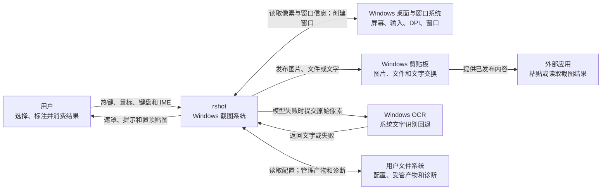
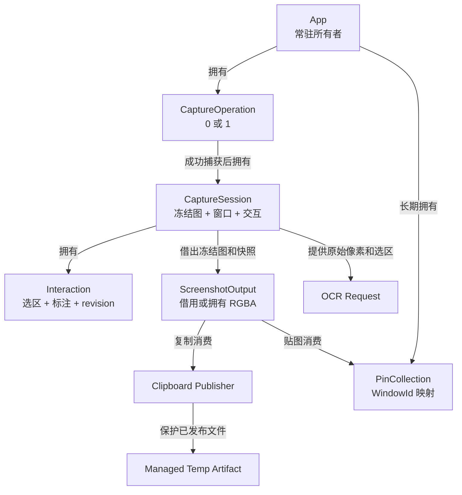
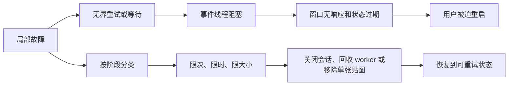
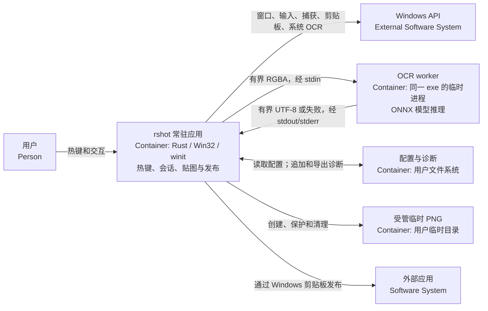
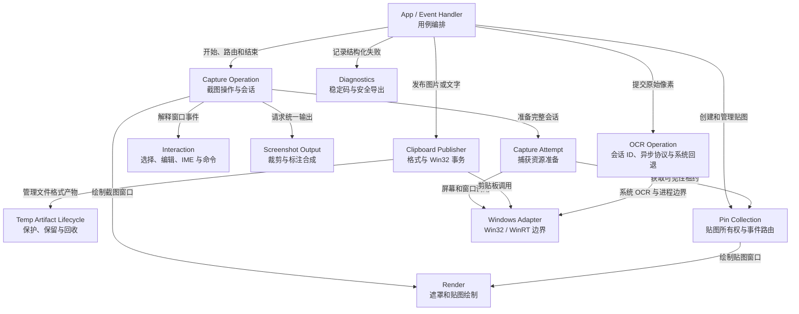
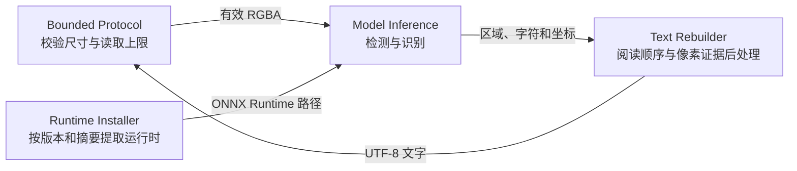

# rshot 设计文档

> 本文按“问题与边界 → 数据与状态 → 操作契约 → 模块与接口 → 质量与恢复 → 方案决策 → C4 视图”的顺序说明 rshot。
>
> 领域术语以 [CONTEXT.md](CONTEXT.md) 为准。版本、测试数量和构建结果分别以 `Cargo.toml`、GitHub Actions 和 `docs/release/results/` 为准，本文不复制这些易变事实。

## 1. 重新表述问题与系统边界

### 1.1 要解决的问题

rshot 帮助 Windows 用户在不离开当前工作上下文的情况下，快速取得屏幕上的一块视觉信息，并将它变成可被其他程序继续使用的图片、文字或置顶参考图。

这不是单纯的“抓取像素”。一次截图操作必须同时处理：屏幕和窗口坐标、冻结画面、区域选择、标注、剪贴板所有权、离线文字识别、置顶窗口，以及任何一步失败后的资源恢复。系统成功的标准不是某个函数返回成功，而是用户得到可消费的结果，或者系统完整回到可重试状态。

### 1.2 目标与范围

当前范围包括：

- 通过全局热键启动单屏截图操作。
- 自动锁定窗口或手动选择区域，并进行画笔、直线、矩形和文字标注。
- 将截图输出发布为剪贴板位图和受管 PNG 文件。
- 从冻结图或选区进行离线文字识别，并将文字发布到剪贴板。
- 将截图输出创建为可移动、可独立关闭的置顶贴图。
- 用稳定错误码记录隐私安全的失败信息并导出诊断。

当前不包括：

- macOS、Linux、移动端。
- 跨显示器联合框选、滚动长截图、录屏和延时截图。
- 截图历史、云同步、账户和服务端。
- 标注对象选择、图层、移动和完整撤销树。
- 后台 OCR 服务与运行中自动升级。

### 1.3 输入、输出与状态变化

| 类别 | 内容 |
| --- | --- |
| 人的输入 | 截图/退出热键，鼠标选择与拖动，工具和颜色选择，键盘、IME、复制、OCR、贴图、取消和关闭动作 |
| 外部输入 | Windows 显示器与窗口信息、桌面像素、DPI、剪贴板状态、系统 OCR 能力、配置文件 |
| 时间输入 | 双击时间窗、剪贴板打开重试、OCR worker 超时、临时产物保留期 |
| 可见输出 | 遮罩和编辑界面、提示、置顶贴图 |
| 可消费输出 | 剪贴板图片、剪贴板文件、剪贴板文字 |
| 持久状态 | 用户配置、受管临时产物、隐私安全诊断日志 |
| 瞬时状态 | 一次截图操作、冻结图、选区、标注、OCR worker、贴图隐藏租约 |

### 1.4 约束与失败情形

- 仅支持 Windows，内部统一使用物理像素并请求 Per-Monitor V2 DPI awareness。
- 同一时刻最多有一个活动截图会话，最多保留 8 张贴图。
- 截图像素和 OCR 内容具有隐私敏感性，不能进入持久诊断。
- 剪贴板、窗口、图形表面和 OCR worker 都是外部资源，可能不可用、部分成功或超时。
- 捕获可能因光标读取、显示器匹配、贴图隐藏、像素读取或窗口/Surface 创建失败而中断。
- 发布可能出现剪贴板被占用、部分格式成功、关闭失败或临时文件仍被外部程序引用。
- OCR 模型可能不可用、返回空结果或超时；Windows OCR 也可能因语言包或系统能力失败。

### 1.5 带条件的需求

| 条件 | 系统必须做到 | 判断证据 |
| --- | --- | --- |
| 捕获任一步失败 | 不提交截图会话，恢复全部贴图，热键可再次使用 | 连续触发截图仍能成功 |
| 用户重新选择 | 保留同一冻结图，清除旧选区和标注 | 像素源不变，交互状态复位 |
| 图片发布至少一种格式成功 | 报告实际格式；仅在事务状态允许时结束会话 | 外部消费者能读取已报告格式 |
| OCR 模型失败 | 尝试 Windows OCR；两者都失败时恢复原会话 | 用户可继续编辑或重试 |
| 单张贴图渲染失败 | 只移除该贴图 | 其他贴图和热键继续工作 |
| 诊断导出 | 只包含固定元数据、事件和稳定错误码 | 不含像素、文字、路径、标题和坐标 |

### 1.6 C4 系统上下文

图中 rshot 是系统边界；Windows OCR、剪贴板、桌面环境和文件系统都是外部依赖，不是 rshot 内部模块。

## 2. 数据、状态与关系

### 2.1 信息模型与所有权

| 数据 | 形状与状态 | 所有者 | 生命周期与关联 |
| --- | --- | --- | --- |
| `CaptureOperation` | `Preparing` 或持有 `CaptureSession` | `App` | 从接受热键到失败清理、复制、OCR、贴图或取消 |
| `CaptureSession` | 冻结图、遮罩窗口、交互状态 | `CaptureOperation` | 一个活动会话；不独立于截图操作存在 |
| 冻结图 | 一张 RGBA 物理像素图 | `CaptureSession` | 重新选择、OCR 和输出共享；转为未修改全图贴图时可转移所有权 |
| 选区 | 无，或两个物理像素点形成的规范化矩形 | `Interaction` | 相对于冻结图；决定 OCR 和输出范围 |
| 标注集合 | 按创建顺序排列的形状与颜色 | `Interaction` | 只影响截图输出，不改变冻结图 |
| 输出快照 | 选区、标注借用及 `revision` | `Interaction` | 用于输出和贴图两阶段提交；revision 防止陈旧计划 |
| `ScreenshotOutput` | 借用冻结图或拥有合成后的 RGBA | `output` 产生，调用方消费 | 复制和贴图共用语义 |
| `PinCollection` | `WindowId → PinnedWindow`，另有捕获隐藏状态 | `App` | 独立于截图会话；最多 8 项 |
| 受管临时产物 | 唯一 PNG 路径及保护/保留状态 | `temp_artifact` | 被剪贴板引用期间受保护，之后按白名单和保留期回收 |
| OCR 操作 | 会话 ID、有界 RGBA、选区、截止时间和取消标记 | `OcrOperation` | 后台线程完成后产生完成、失败、超时或取消事件；旧会话结果被丢弃 |
| 诊断记录 | 时间、版本、事件、稳定错误码 | `diagnostics` | 有大小上限；导出时再次解析和过滤 |

### 2.2 关系图

### 2.3 数据不变量

1. 冻结图始终是未标注、且不包含 rshot 贴图的原始屏幕像素。
2. 选区、窗口锁定、预览、OCR 和最终输出使用同一物理像素坐标系。
3. 标注只能追加到编辑状态，不得修改冻结图。
4. 捕获尝试全部成功后才提交 `CaptureSession`。
5. 贴图隐藏租约只覆盖桌面像素读取，结束或析构都恢复贴图。
6. `PinPlan.revision` 必须等于提交时的交互 revision；否则拒绝陈旧提交。
7. 图片复制至少发布一种格式且成功关闭剪贴板后，才可按成功路径结束会话。
8. OCR 只读取冻结图或其选区，不读取标注层。
9. 受管临时产物只有在文件格式成功交给系统后才进入保留状态。
10. 无活动会话和贴图时，不保留截图像素，也不加载 OCR 模型。

### 2.4 HTDP 数据形状检查

| 数据形状 | 示例 | 必须处理的结果 |
| --- | --- | --- |
| 无选区、无标注 | 整屏直接复制 | 借用整张冻结图，不做像素复制 |
| 一个有效选区 | 从右下拖到左上 | 先规范化坐标，再裁剪 |
| 零面积选区 | 起点与终点同线 | 不进入有效编辑输出，保持或恢复选择状态 |
| 多个标注 | 画笔、矩形、文字混合 | 按创建顺序合成；任一必需文字栅格化失败则整体失败 |
| 空贴图集合 | 首次创建贴图 | 准备成功后插入并显示 |
| 8 张贴图 | 再创建一张 | 拒绝第 9 张，保留会话和已有贴图 |
| OCR 空文字 | 模型成功但无文本 | 转入结构化回退，而非当作最终成功 |
| 剪贴板部分成功 | DIB 成功、文件格式失败 | 报告实际成功格式，不谎报完整成功 |

## 3. 关键操作、状态与失败结果

### 3.1 截图操作契约

| 项目 | 契约 |
| --- | --- |
| 发起条件 | 收到截图热键，且没有活动 `CaptureOperation` |
| 输入 | 光标位置、显示器集合、当前贴图集合、Windows 捕获和窗口能力 |
| 成功结果 | 产生一个持有冻结图、遮罩窗口和选择状态的会话 |
| 失败结果 | 无活动会话；本次窗口和 Surface 已释放；贴图可见；错误阶段可诊断 |
| 不承诺 | 不保证跨屏联合选择，不保证捕获外部受保护内容 |

捕获顺序固定为：读取光标 → 定位捕获显示器 → 匹配遮罩显示器 → 获取贴图隐藏租约 → 读取冻结图 → 立即恢复贴图 → 枚举窗口 → 创建 Window、Context 和 Surface → 原子提交会话。

### 3.2 会话状态转移

| 当前状态 | 事件 | 下一状态 | 动作或结果 |
| --- | --- | --- | --- |
| Idle | 截图热键 | Preparing | 开始捕获尝试 |
| Preparing | 全部资源就绪 | Selecting | 提交会话并显示遮罩 |
| Preparing | 任一步失败 | Idle | 清理本次资源、恢复贴图、记录错误码 |
| Selecting | 有效拖选或窗口确认 | Editing | 固定选区并显示编辑工具 |
| Selecting | 取消 | Idle | 关闭会话 |
| Editing | 重新选择 | Selecting | 保留冻结图，清除选区和标注 |
| Editing | 复制成功 | Idle | 发布输出并关闭会话 |
| Editing | OCR | Editing（后台识别） | 隐藏遮罩但保留会话；贴图和事件循环继续响应 |
| Editing（后台识别） | 当前 ID 完成 | Idle | 发布文字并结束会话 |
| Editing（后台识别） | 失败或超时 | Editing | 恢复同一会话供重试 |
| Editing（后台识别） | 取消 | Idle | 标记取消，关闭当前会话；随后到达的结果丢弃 |
| Selecting 或 Editing | 贴图成功 | Idle | 将同一输出提交给贴图集合 |
| Selecting 或 Editing | 输出/发布失败 | 原状态 | 保留可重试数据；按确定性决定是否允许结束 |
| Selecting 或 Editing | 渲染故障 | Idle | 关闭故障会话，保留常驻应用和贴图 |

### 3.3 输出、剪贴板、OCR 与贴图契约

| 操作 | 输入 | 成功结果 | 失败结果 | 结束后不变量 |
| --- | --- | --- | --- | --- |
| 生成截图输出 | 冻结图、选区、标注 | 借用原图或产生合成 RGBA | 返回稳定输出阶段，不交付半成品 | 冻结图未被修改 |
| 发布图片 | `ScreenshotOutput`、剪贴板 owner | 返回实际发布格式及事务确定性 | 报告失败阶段；保护已交给系统的产物 | 不删除仍被引用的 PNG |
| 文字识别 | 冻结图或选区原始像素 | 模型或 Windows OCR 返回非空文字 | 两级失败后恢复会话并记录最终阶段 | 不识别标注内容，不持久化文字 |
| 创建贴图 | 输出、位置、尺寸、revision | 准备窗口后原子插入集合 | 容量、窗口、Surface 或陈旧计划失败时不改变集合 | 已有贴图不受影响 |
| 关闭贴图 | 对应 `WindowId` 或关闭手势 | 释放该贴图的 Surface、Window 和 RGBA | 未找到时不影响其他项 | 其他贴图保持原状态 |

### 3.4 正常、边界和失败示例

| 类别 | 场景 | 预期结果 |
| --- | --- | --- |
| 正常 | 选择区域并复制 | 裁剪并合成标注，外部应用可读取至少一种图片格式 |
| 正常 | 模型 OCR 返回文字 | 将文字发布到剪贴板，worker 退出，会话结束 |
| 边界 | 无选区直接贴图 | 复用冻结图所有权，贴图尺寸不小于窗口最小值 |
| 边界 | 捕获期间创建的新贴图 | 租约结束前保持隐藏，结束后统一显示 |
| 失败 | 捕获像素失败 | 贴图恢复，不产生会话，下一次热键仍可用 |
| 失败 | 文字栅格化失败 | 输出整体失败，用户仍处于原编辑会话 |
| 失败 | OCR worker 超时 | 回收 worker，尝试 Windows OCR；最终失败则恢复会话 |
| 失败 | 第 9 张贴图 | 新建失败，已有 8 张和当前会话保持不变 |

## 4. 抽象、模块与接口边界

### 4.1 模块职责

| 模块 | 拥有的规则 | 依赖 | 不负责 |
| --- | --- | --- | --- |
| `app` | 常驻状态和跨模块用例编排 | 下列领域模块与 Windows 事件循环 | 截图交互细节和外部格式算法 |
| `capture_operation` | 截图操作、会话资源和高层命令 | `attempt`、`interaction`、`output` | 剪贴板事务、OCR 推理、贴图集合 |
| `capture_operation::attempt` | 显示器匹配、贴图隐藏、捕获和遮罩资源准备 | xcap、winit、`pinned` 租约 | 选择和编辑 |
| `capture_operation::interaction` | 选择、编辑、工具、IME、revision | 几何与编辑模型 | Window 创建和业务副作用 |
| `output` | 裁剪和标注合成 | 冻结图与输出描述 | 剪贴板和窗口生命周期 |
| `clipboard` | 格式准备、Win32 事务和结果确定性 | `temp_artifact`、Win32 | 图像如何产生 |
| `temp_artifact` | 唯一创建、保护、保留和白名单清理 | 文件系统、剪贴板引用查询 | 任意临时文件 |
| `ocr` | 模型优先、Windows 回退和失败分类 | `ocr::worker`、Windows OCR | 截图会话所有权 |
| `ocr::operation` | 会话 ID、后台执行、完成/失败/超时/取消协议和旧结果抑制 | `ocr` 编排、事件线程轮询 | 用户提示和剪贴板副作用 |
| `ocr::worker` | 有界协议、模型推理、超时和子进程回收 | oar-ocr、ONNX Runtime、Job Object | 用户提示和剪贴板 |
| `pinned` | 贴图集合、事件路由、隐藏租约与关闭 | winit、softbuffer | 截图选择和标注 |
| `render` | 遮罩、工具栏、标注预览和贴图绘制 | softbuffer | 状态迁移 |
| `windows_adapter` | 通用 Win32/WinRT 与 unsafe 封装 | Windows API | 产品流程 |
| `diagnostics` | 稳定错误码、限额日志和安全导出 | 文件系统 | 保存原始错误或用户内容 |

### 4.2 关键接口契约

| 接口 | 交入 | 交回 | 失败 | 未承诺的内部细节 |
| --- | --- | --- | --- | --- |
| `CaptureOperation::start` | 捕获上下文 | 完整会话 | `CaptureAttemptFailure` | 捕获库和窗口创建步骤可替换 |
| `copy_source` | 可编辑会话 | owner 与 `ScreenshotOutput` | 未就绪、无窗口、输出失败 | 输出可能借用或拥有像素 |
| `ocr_source` | 可编辑会话 | 原始像素、选区和 owner | 未就绪或无窗口 | OCR 后端选择 |
| `prepare_pin` / `commit_pin` | 会话快照；随后提交计划 | 尺寸/位置计划；最终 RGBA | 输出失败、陈旧 revision | 是否复用冻结图由模块决定 |
| `clipboard::publish` | 已准备内容和 owner | 实际格式、阶段、确定性 | 准备或 Win32 事务失败 | 格式发布顺序可演进 |
| `pinned::hide_for_capture` | 当前贴图集合 | RAII 可见性租约 | 已隐藏或隐藏失败 | 每个窗口的具体隐藏调用 |
| `ocr::recognize` | 有界原始像素 | 文字或结构化失败 | 模型、协议、超时、Windows 回退失败 | 模型和运行时提取位置 |
| `OcrOperation` | 会话 ID、截止时间和拥有的像素副本 | 带相同 ID 的完成、失败、超时或取消事件 | 启动线程失败或后端失败 | 后台线程和 channel 实现 |

### 4.3 稳定流程、变化点和扩展点

稳定流程是“捕获原始像素 → 建立会话 → 选择/编辑 → 生成统一输出 → 发布或转为贴图”。变化点集中在边界：

| 变化 | 主要影响 | 应保持不变 |
| --- | --- | --- |
| 更换屏幕捕获库 | `attempt` 和平台适配 | 冻结图含义、原子提交和恢复语义 |
| 增加标注类型 | `interaction`、`output`、`render` | 标注顺序、冻结图不可变 |
| 增加剪贴板格式 | `clipboard` 与临时产物保护 | 部分成功报告和事务确定性 |
| 更换 OCR 模型 | `ocr::worker` 和后处理 | 原始像素输入、回退和有界协议 |
| 增加贴图手势 | `pinned::interaction` | `WindowId` 隔离和单项失败边界 |
| 增加配置字段 | 配置模型和迁移 | `serde(default)` 兼容旧配置 |

只有两个以上具体场景共享相同步骤并具有明确变化点时，才提升新的复用接口；新功能反复修改稳定流程时，应重新划分模块，而不是继续增加条件分支。

## 5. 质量要求、故障边界与恢复目标

### 5.1 质量场景

| 刺激源 | 刺激 | 环境 | 受影响对象 | 响应 | 响应度量 |
| --- | --- | --- | --- | --- | --- |
| 用户 | 连续触发截图 | 上一次捕获失败后 | 截图操作 | 清理旧资源并接受下一次热键 | 不需重启进程即可再次进入选择状态 |
| Windows | 剪贴板被短暂占用 | 正常桌面 | 剪贴板发布 | 打开阶段有限重试，其他阶段不盲目重放 | 返回明确阶段、实际格式和确定性 |
| OCR worker | 无响应或崩溃 | 识别期间 | OCR 操作 | 有界等待、终止并回退 Windows OCR | worker 在超时路径退出或被 Job Object 回收 |
| 单张贴图 | Surface 重绘失败 | 多贴图共存 | `PinCollection` | 只移除故障项 | 其他贴图仍可移动和关闭 |
| 用户 | DPI 或显示器切换 | 多屏环境 | 坐标与渲染 | 使用物理像素匹配捕获和遮罩显示器 | 选区、预览和输出指向同一像素区域 |
| 维护者 | 导出诊断 | 用户报告故障 | 隐私数据 | 重新解析并只导出白名单字段 | 导出中无像素、OCR 文字、标题、坐标和路径 |

### 5.2 故障处理表

| 故障边界 | 外部表现与影响 | 预防/隔离 | 恢复与验证 |
| --- | --- | --- | --- |
| 捕获尝试 | 无法进入截图 | RAII 隐藏租约；完成后才提交会话 | 清理窗口/Surface、恢复贴图；再次热键验证 |
| 截图渲染 | 当前遮罩不可用 | Surface/Window 生命周期有序 | 关闭故障会话；托盘、热键和贴图保留 |
| 截图输出 | 复制或贴图暂时不能完成 | 输出纯函数式组合，不修改源数据 | 保留会话、选区和标注供重试 |
| 剪贴板发布 | 外部应用可能只看到部分格式 | 阶段化事务、实际格式和确定性 | 保护已发布文件；不确定结果不盲目重复 |
| OCR | 文字未产生或后端无响应 | 后台操作、会话 ID、输入/输出限额和两级超时 | 回收 worker、Windows OCR 有界回退、失败时恢复会话；旧结果无副作用 |
| 单张贴图 | 一张贴图消失或创建失败 | 两阶段创建、容量上限、按 `WindowId` 隔离 | 只移除对应项；已有集合保持一致 |
| 诊断写入 | 缺少诊断记录 | 文件类型检查和大小上限 | 功能继续运行；导出时过滤可用记录 |

### 5.3 故障扩大与控制

剪贴板只在“打开”阶段有限重试；OCR worker、Windows OCR 回退和整个 OCR 操作分别有等待上限；贴图有数量上限；诊断有文件大小上限。OCR 后端运行在事件线程之外，事件线程按会话 ID 接收结果，因此识别期间仍可处理贴图与窗口事件。Windows OCR 超时后其隔离线程可能继续执行，但结果接收端已关闭，不能再改变当前会话。

### 5.4 可观测性、恢复和事后回顾

稳定错误码域为 `RSH-CAP-*`、`RSH-OUT-*`、`RSH-RND-*`、`RSH-CLP-*`、`RSH-OCR-*` 和 `RSH-PIN-*`。持久日志只允许时间、版本、事件和错误码；原始系统错误只用于当前提示，不写入日志。

恢复完成的判据：

- 不存在孤立遮罩窗口、Surface 或 OCR worker。
- 贴图可见性与捕获前一致。
- 会话要么完整保留供重试，要么完整关闭。
- 热键和无关贴图继续响应。
- 剪贴板引用的受管产物仍存在，未引用且过期的白名单产物可回收。

事后回顾至少记录：发生了什么、影响范围、稳定错误码与时间线、为何隔离或恢复没有生效、如何复现、补充哪一层测试、是否需要修改本设计或 ADR。不得附带用户截图、OCR 文本、窗口标题或真实文件路径。

## 6. 方案比较与架构决策

### 6.1 关键方案比较

| 决策 | 选择 | 未选择方案 | 得到 | 付出与失效方式 | 重新评估条件 |
| --- | --- | --- | --- | --- | --- |
| 截图像素来源 | 一次捕获形成不可变冻结图 | 每次输出/OCR 再捕获桌面 | 选择、预览、OCR 和输出一致 | 会话期间占用一张屏幕 RGBA | 需要视频、滚动或跨屏连续捕获 |
| 会话提交 | 捕获资源全部成功后原子提交 | 边准备边写入 `App` | 失败路径清晰、无半会话 | 需要准备对象和 RAII | 捕获步骤变为长时异步管线 |
| 输出边界 | 复制和贴图共用 `ScreenshotOutput` | 两条路径各自裁剪合成 | 语义一致、可复用冻结图 | 输出失败会阻止两类交付 | 两种消费方需要不同色彩或编码语义 |
| OCR 隔离与编排 | 高精度模型放临时 worker；整个编排放后台操作并用会话 ID 回传 | 在事件线程同步等待 | UI、贴图和事件循环可用；旧结果无副作用 | 复制一次 OCR 源像素；Windows OCR 超时线程不能强制终止 | OCR 高频使用或需要并发识别 |
| 图片剪贴板 | 同时尝试 `CF_DIB` 与 `CF_HDROP` | 只发布单一格式 | 兼容位图和文件消费者 | 允许部分成功；需要临时文件生命周期 | Windows 消费者生态或格式需求变化 |
| 贴图集合 | 每图独立窗口，以 `WindowId` 路由 | 单窗口内管理所有贴图 | OS 级置顶、移动和故障隔离 | 每图持有 Surface 和 RGBA | 贴图数量或合成性能要求显著提高 |
| 坐标 | 全链路物理像素 | 逻辑坐标混合转换 | 捕获、选区和输出直接对应 | DPI/显示器匹配必须正确 | 引入矢量输出或跨平台 UI |
| 诊断 | 稳定码与白名单导出 | 保存原始错误上下文 | 隐私边界稳定、可公开提交 | 现场细节较少，排障依赖复现 | 获得明确授权的本地高级诊断模式 |

这些选择优先保证结果一致、失败可恢复和隐私安全，而不是最少代码或单次操作的理论最低延迟。

### 6.2 当前已接受的代价

- Windows OCR 回退有等待上限，但 WinRT 调用本身不能被当前适配器强制终止；超时后依靠隔离和结果丢弃保证正确性。
- 当前只允许一个活动 OCR 操作；取消是协作式协议，不承诺立即终止已经进入的外部调用。
- 每张贴图独立保留 RGBA 和 Surface，以数量上限换取简单隔离。
- 事件循环仍有固定周期唤醒，待命功耗尚无跨设备基线。
- 真实 DPI、多屏、IME、外部剪贴板消费者和升级/回退仍依赖版本化 Windows 回归矩阵。

### 6.3 试验与重新选择条件

正式稳定发布前，以 [Windows 回归矩阵](release/windows-regression-matrix.md) 验证 DPI、多屏、IME、剪贴板、OCR 与升级/回退。以下证据出现时重新比较方案：

- Windows OCR 超时线程造成可测量的资源累积：改用可直接取消的 WinRT 异步操作适配器或独立回退进程。
- 常见外部消费者无法读取现有格式：评估新增 PNG/HTML 等剪贴板格式。
- 8 张贴图不足成为常见需求或资源增长明显：评估共享渲染资源或合成窗口。
- 多屏联合框选成为核心需求：重新设计冻结图、坐标空间和捕获边界。
- 待命功耗超过可接受基线：以事件驱动唤醒替代固定周期轮询。

## 7. 用 C4 说明选定架构

### 7.1 容器图

C4 的 Container 表示可独立运行的应用、进程或数据存储，不是 Rust 模块或目录。rshot 发布为一个 `rshot.exe`，但运行时包含常驻主进程和按需启动的 OCR worker 角色。

部署时只有一个可执行文件。主进程按需以特殊参数启动自身成为 worker；worker 加入 kill-on-close Job Object，完成、失败或超时后退出。ONNX Runtime 和模型由 worker 使用，主进程待命时不加载它们。

### 7.2 常驻应用组件图

箭头表示发起调用或请求结果，不表示数据所有权；所有权以第 2 节为准。组件是主进程内部协作部分，不独立部署。

### 7.3 OCR worker 组件图

后处理只依据识别区域坐标和原图像素证据恢复阅读顺序、项目符号、成对引号和混排空格，不依据句义猜写字符。

### 7.4 图例与检查清单

- `Person` 是系统使用者；`Software System` 是系统边界外的依赖；`Container` 是运行进程或数据存储；`Component` 是进程内职责单元。
- 箭头方向表示动作或信息流方向，标签说明交换内容。
- 每张图只回答一个层次的问题；代码文件和函数不进入 Context 或 Container 图。
- Surface 必须先于对应 Window 释放；这是 Windows 资源生命周期约束，不改变 C4 层次。

## 文档维护规则

以下变化必须同步更新本文，并在形成长期取舍时补充或更新 `docs/adr/`：

- 系统边界、截图状态、数据所有权或失败恢复语义改变。
- 模块职责、跨模块接口、剪贴板格式、OCR 后端或贴图交互改变。
- 配置兼容、错误码、隐私边界或重新评估条件改变。

易变事实直接查询其事实源：当前版本查 `Cargo.toml`，测试和构建查 GitHub Actions，发布状态查 GitHub Releases，人工 Windows 证据查 `docs/release/results/`。本文记录“为什么这样设计”和“必须保持什么”，不缓存一次构建的数字。
