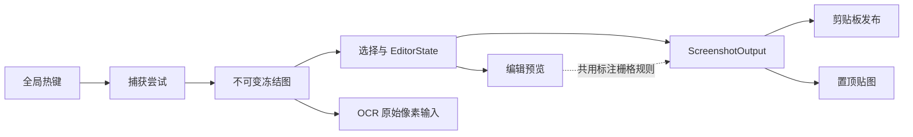

# 从 rshot 学架构与工程实践

这份文档面向希望通过真实项目学习 Rust、桌面应用和软件架构的开发者。建议先读本文建立全局认识，再配合 [系统架构与行为](ARCHITECTURE.md)、[领域词汇](CONTEXT.md) 和代码阅读。

## 先理解这个项目解决了什么

rshot 看起来是一个截图工具，但它真正处理的是一组必须保持一致的状态和外部资源：

- 在正确的显示器、DPI 和物理坐标中捕获桌面像素。
- 冻结捕获结果，让选择、标注、OCR 和输出面对同一份图像。
- 在编辑过程中管理选区、标注、工具、IME、Undo/Redo 和交互反馈。
- 向 Windows 剪贴板发布多种图片格式。
- 创建、隐藏、恢复和关闭多个置顶贴图窗口。
- 在捕获、渲染、OCR 或剪贴板失败后恢复到可继续使用的状态。

它适合学习的原因，是这些问题不能只靠“把功能写出来”解决，还需要明确的数据所有权、状态迁移、失败语义和测试边界。

## 建立一张架构地图

一次截图的主要数据流如下：

| 模块 | 主要职责 | 值得观察的边界 |
| --- | --- | --- |
| `capture_operation` | 捕获尝试、截图会话和高层命令 | 只有资源全部就绪后才提交会话 |
| `interaction` | 把窗口事件转换为编辑动作 | 原始输入与领域行为分离 |
| `editor` | 工具、标注、选中对象和历史记录 | 不依赖窗口或 Windows API |
| `output` | 裁剪并合成最终图片 | 复制和贴图使用同一输出语义 |
| `render` | 遮罩、工具栏和编辑装饰 | 选框等界面装饰不进入输出 |
| `clipboard` | 发布 DIB、PNG 文件和文字 | 允许部分格式成功，但不能谎报结果 |
| `pinned` | 多贴图窗口和隐藏租约 | 每张窗口独立，截图期间统一隐藏 |
| `ocr` | 后台识别、回退、超时和取消 | 结果绑定截图会话，陈旧结果无副作用 |
| `temp_artifact` | 管理剪贴板引用的 PNG | 临时文件也有明确生命周期 |

## 可以学到的架构思想

### 用不可变数据稳定复杂流程

捕获成功后产生一张不可变的“冻结图”。选区、预览、OCR、复制和贴图都从它派生，而不是反复读取桌面。

这样做解决了三个问题：桌面内容不会在操作途中变化；标注不会污染 OCR 输入；复制和贴图可以验证是否来自相同源像素。可以把它理解为一次操作内部的事实源（source of truth）。

对应代码主要在 `capture_operation`、`interaction::OutputSnapshot` 和 `output::ScreenshotOutput`。

### 让数据所有权表达生命周期

项目没有依赖一个到处可写的全局状态。`App` 拥有截图操作和贴图集合，截图操作拥有会话，会话拥有冻结图、窗口和交互状态。对象被销毁时，相关资源随之释放。

这体现了 Rust 很有价值的一点：所有权不仅用于避免内存错误，也可以表达业务规则。谁拥有资源、资源能活多久、失败时由谁恢复，都能从类型和字段关系中看出来。

阅读时重点关注 `CaptureOperation`、`CaptureSession`、`PinVisibilityLease` 和受管临时产物的 `Drop` 行为。

### 用状态机代替布尔变量组合

截图至少经历捕获、选择、编辑、OCR 等状态。项目用枚举和状态对象限制每个阶段可以发生的动作，而不是通过多个布尔值拼出大量非法组合。

例如选择阶段没有 `EditorState`，编辑阶段才拥有它；终止命令产生后，不再同时请求普通重绘或继续输入。这类建模能让“不可能状态不可表示”更接近现实。

### 把纯领域逻辑从系统适配层中分离

`EditorState` 负责标注选择、命中测试、移动、缩放、文字编辑和历史记录，但它不知道 winit 窗口、剪贴板或 Windows HWND。事件层负责把按键和鼠标翻译成这些动作，窗口层只应用光标、IME 和重绘等副作用。

这种分层带来的直接收益是：绝大多数编辑行为可以用普通单元测试验证，不需要真的打开截图窗口。

### 一个输出边界消除“预览正确、导出错误”

截图工具很容易出现预览已经遮挡敏感信息，复制结果却仍包含原图的严重问题。rshot 把裁剪和标注合成集中在 `ScreenshotOutput`，复制与贴图都消费它；预览也复用相同的标注栅格规则。

选择框、控制点、工具栏和文字光标则只由 `render` 绘制，永远不会成为输出描述的一部分。这是“领域输出”和“编辑界面”必须分离的具体例子。

### 用事务思维处理多步骤外部操作

捕获屏幕、创建窗口、打开剪贴板、发布多个格式都可能只完成一部分。项目为这些操作定义明确的提交点：

1. 捕获所需资源全部成功后，才提交截图会话。
2. 图片发布记录每种格式的实际结果。
3. 剪贴板成功关闭后，才把已发布内容当作可靠结果。
4. 贴图准备成功后才插入集合并显示。

这和数据库事务的思路类似：准备、提交、失败回滚，只是对象换成了桌面资源。

### 用版本号阻止陈旧计划提交

准备贴图输出和真正创建窗口之间，标注可能再次变化。交互层用 `revision` 标识输出快照；提交时如果版本不一致，就拒绝陈旧计划。

这是乐观并发控制的一个小型实例。即使程序主要运行在单事件线程上，只要存在“先计算、后提交”的两阶段操作，就可能需要版本校验。

### 用有界快照简化 Undo/Redo

编辑历史保存标注集合的提交前/后快照。一次画图、拖动、调整、改色、文字编辑或删除只形成一个历史步骤；拖动过程中的每一帧不会进入历史。最多保存 100 步，新编辑会清空 Redo。

相比为每种形状实现反向命令，快照更耗内存，但实现简单、恢复可靠。这个选择展示了工程中的重要原则：先根据数据规模和失败风险选择足够简单的方案，不为理论上的最优复杂化系统。

### 用 Adapter 和 Fake 测试不可控边界

Windows 剪贴板、OCR、窗口和时间都不可完全控制。项目把它们放到适配器或 trait 后面，测试使用记录调用的 Fake 实现，从而验证：重试次数、调用顺序、超时、部分成功和资源恢复。

这比大量端到端测试更快、更稳定；真正依赖显示器、DPI、IME 和外部应用的部分再留给 Windows 交互回归矩阵。

## 可以学到的编程方法

### 先定义不变量，再写分支

项目中最重要的代码不是某个算法，而是这些始终成立的约束：冻结图不被修改；OCR 不读取标注；选框不进入输出；第九张贴图失败不能破坏前八张；陈旧 OCR 结果不能结束当前会话。

遇到复杂功能时，可以先把不变量写进 ADR、架构文档和测试，再实现正常路径。这样评审代码时关注的是“是否破坏约束”，而不只是“这个按钮能不能用”。

### 以垂直切片做 TDD

标注编辑功能不是一次把工具栏、渲染和事件全写完，而是按可验证能力推进：

1. 建立 Undo/Redo 历史。
2. 实现顶层标注命中和整体移动。
3. 实现端点和角点调整。
4. 实现改色、删除和文字重编辑。
5. 接入窗口事件和只用于预览的选择装饰。

每个切片先写失败测试，再增加最少实现。这种节奏能把一次大型 UI 改动拆成多个可证明的小结论。

### 区分自动测试与人工验证

像素合成、状态迁移和错误恢复适合自动测试；多显示器实际拓扑、混合 DPI、IME 候选框位置、图标辨识度和外部应用兼容性必须人工验证。

好的工程流程不是追求“全部自动化”，而是明确每种风险由哪种证据覆盖。`docs/release/windows-regression-matrix.md` 就是这条边界的记录。

### 让错误结果具有稳定语义

项目使用阶段和稳定错误码描述失败，诊断只保留白名单元数据，不记录截图像素、OCR 内容、窗口标题或坐标。调用方因此可以区分失败发生在哪里，同时不会为了排错制造新的隐私风险。

## 这个项目真正困难的地方

| 难点 | 为什么难 | 项目的处理方式 |
| --- | --- | --- |
| 多显示器与 DPI | Windows 逻辑坐标、物理像素和负坐标容易混用 | 请求 Per-Monitor V2，全链路使用物理像素 |
| 冻结画面与贴图 | 已有置顶贴图可能被再次截入；隐藏太久又影响使用 | 截图操作持有隐藏租约，结束或失败时统一恢复 |
| 预览与最终输出一致 | 两套绘制代码容易产生像素偏差或隐私泄漏 | 共用标注栅格规则，输出由统一边界生成 |
| 马赛克 | 不能从已经马赛克过的图再次采样，否则重叠顺序改变结果 | 每块始终从冻结图采样，马赛克先于普通标注合成 |
| 中文 IME 和光标 | UTF-8 字节位置、UTF-16 系统 API、预编辑文本宽度不同 | 光标只落在 UTF-8 边界，适配层负责系统文字测量 |
| 剪贴板兼容 | 不同应用消费 DIB、文件列表或文字；剪贴板还会被占用 | 发布多格式、有限重试并报告实际成功格式 |
| 异步 OCR | 模型慢、可能超时，旧任务可能晚于新会话返回 | 会话 ID、总截止时间、取消标志和两个可终止 OCR worker 进程 |
| 多贴图窗口 | 事件广播可能误关全部窗口，失败也可能污染集合 | 以 `WindowId` 隔离所有权，准备后提交，单窗失败单独移除 |
| 可编辑标注 | 命中层级、拖动中间态、控制点、历史粒度互相影响 | `EditorState` 集中管理选择和历史，一次手势一次提交 |
| Windows 资源清理 | 正常关闭、部分失败和析构都必须释放窗口、Surface、文件和可见性 | 明确所有者、两阶段提交和 `Drop` 兜底 |

## 推荐的代码阅读路线

### 第一遍：看系统如何活起来

1. 从 `src/main.rs` 找到应用入口。
2. 阅读 `src/app/mod.rs`，理解常驻 `App` 拥有什么。
3. 沿截图热键进入 `capture_operation`，观察捕获尝试如何变成截图会话。
4. 暂时跳过像素算法和 Windows API 细节，只记录状态变化。

目标是能回答：“一次截图从开始到结束，哪些对象先后被创建和销毁？”

### 第二遍：沿一次编辑和输出读取

1. 在 `interaction/event.rs` 找鼠标和键盘事件。
2. 看 `interaction/actions.rs` 如何调用 `EditorState`。
3. 在 `editor.rs` 追踪创建标注、选择、变换和 Undo/Redo。
4. 在 `output` 中看同一批标注如何生成最终像素。
5. 对比 `render.rs`，确认哪些内容只属于界面。

目标是能回答：“为什么蓝色控制点不会出现在复制结果里？”

### 第三遍：专门阅读失败路径

选择一个外部边界，例如剪贴板、OCR 或贴图，然后只读它的失败分支和测试。记录每一步：谁拥有资源、失败返回什么、状态是否仍可重试、析构是否能兜底。

目标是从“会写正常路径”提升到“能设计可恢复的系统”。

## 建议动手练习

| 练习 | 主要学习点 | 完成标准 |
| --- | --- | --- |
| 给选择工具增加悬停轮廓 | 输入状态与纯预览分离 | 复制结果不含悬停效果 |
| 给历史容量写边界测试 | 有界数据结构和不变量 | 第 101 次编辑只淘汰最旧记录 |
| 为剪贴板增加一个失败 Fake | Adapter 与部分成功 | 不调用真实 Windows 剪贴板也能验证语义 |
| 为新标注设计 ADR | 先决策后实现 | 写清坐标、层级、零面积、Undo 和输出一致性 |
| 模拟陈旧 OCR 完成事件 | 异步结果隔离 | 旧结果不能修改当前截图会话 |
| 画出贴图隐藏租约时序图 | RAII 与资源生命周期 | 正常、失败和取消路径都能恢复贴图 |

## 判断自己是否真正理解

如果能够不看文档回答下面的问题，就已经掌握了这个项目最重要的部分：

1. 为什么必须先形成冻结图，而不能复制时再截图？
2. 为什么 OCR 不消费 `ScreenshotOutput`？
3. 为什么复制与贴图必须共享输出边界？
4. 为什么贴图隐藏使用租约，而不是捕获完成后立即显示？
5. 为什么选中框属于 `render`，而不属于标注模型？
6. 为什么 Undo/Redo 以一次完成手势为单位？
7. 哪些问题可以单元测试，哪些必须在真实 Windows 环境验证？
8. 任意一个外部步骤失败时，系统由谁恢复到可重试状态？

进一步阅读决策背景时，从 [ADR 目录](adr/) 开始；想了解当前实现事实时，以 [系统架构与行为](ARCHITECTURE.md) 为准。
